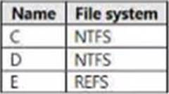
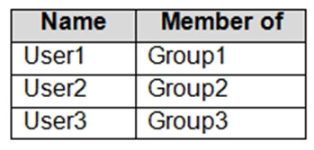

# ⬆️ Microsoft Azure AZ-800 (Windows Server Hybrid Administrator) Practice Tests Exams Questions & Answers

## Table of Contents

| No. | Questions |
| --- | --------- |
| 1   | [You have a server named Server1 that runs Windows Server. Server1 has the storage pools shown in the following table. You plan to create a virtual disk named VDisk1 that will use storage tiers.](#you-have-a-server-named-server1-that-runs-windows-server-server1-has-the-storage-pools-shown-in-the-following-table-you-plan-to-create-a-virtual-disk-named-vdisk1-that-will-use-storage-tiers)
| 2   | [Your network contains an Active Directory Domain Services (AD DS) domain named adatum.com. The domain contains a ‘He server named Server1 and three users named User1. User2 and User), Server1 contains a shared folder named Share1 that has the following configurations. The share permissions for Share1 are configured as shown in the Share Permissions exhibit. Share! contains a file named Filel.txt. The advanced security settings for Filel.txt are configured as shown in the File Permissions exhibit. When User1 connects to \\Server1.adatum.com\Share1\, the user can take ownership of File1.txt.](#your-network-contains-an-active-directory-domain-services-ad-ds-domain-named-adatumcom-the-domain-contains-a-he-server-named-server1-and-three-users-named-user1-user2-and-user-server1-contains-a-shared-folder-named-share1-that-has-the-following-configurations-the-share-permissions-for-share1-are-configured-as-shown-in-the-share-permissions-exhibit-share-contains-a-file-named-fileltxt-the-advanced-security-settings-for-fileltxt-are-configured-as-shown-in-the-file-permissions-exhibit-when-user1-connects-to-%5C%5Cserver1adatumcom%5Cshare1%5C-the-user-can-take-ownership-of-file1txt)
| 3   | [Your network contains an Active Directory Domain Services (AD DS) domain named adatum.com. The domain contains a ‘He server named Server1 and three users named User1. User2 and User), Server1 contains a shared folder named Share1 that has the following configurations. The share permissions for Share1 are configured as shown in the Share Permissions exhibit. Share! contains a file named Filel.txt. The advanced security settings for Filel.txt are configured as shown in the File Permissions exhibit. When User2 connects to \\Server1.adatum.com\Share1\, File1.txt is visible.](#your-network-contains-an-active-directory-domain-services-ad-ds-domain-named-adatumcom-the-domain-contains-a-he-server-named-server1-and-three-users-named-user1-user2-and-user-server1-contains-a-shared-folder-named-share1-that-has-the-following-configurations-the-share-permissions-for-share1-are-configured-as-shown-in-the-share-permissions-exhibit-share-contains-a-file-named-fileltxt-the-advanced-security-settings-for-fileltxt-are-configured-as-shown-in-the-file-permissions-exhibit-when-user2-connects-to-%5C%5Cserver1adatumcom%5Cshare1%5C-file1txt-is-visible)
| 4   | [Your network contains an Active Directory Domain Services (AD DS) domain named adatum.com. The domain contains a ‘He server named Server1 and three users named User1. User2 and User), Server1 contains a shared folder named Share1 that has the following configurations. The share permissions for Share1 are configured as shown in the Share Permissions exhibit. Share! contains a file named Filel.txt. The advanced security settings for Filel.txt are configured as shown in the File Permissions exhibit. When User3 connects to \\Server1.adatum.com\Share1\, File1.txt is visible.](#your-network-contains-an-active-directory-domain-services-ad-ds-domain-named-adatumcom-the-domain-contains-a-he-server-named-server1-and-three-users-named-user1-user2-and-user-server1-contains-a-shared-folder-named-share1-that-has-the-following-configurations-the-share-permissions-for-share1-are-configured-as-shown-in-the-share-permissions-exhibit-share-contains-a-file-named-fileltxt-the-advanced-security-settings-for-fileltxt-are-configured-as-shown-in-the-file-permissions-exhibit-when-user3-connects-to-%5C%5Cserver1adatumcom%5Cshare1%5C-file1txt-is-visible)
| 5   | [Contoso, Ltd. is a company that has a main office in Seattle and two branch offices in Los Angeles and Montreal. The network contains an on premises Active Directory Domain Services (AD DS) forest named contoso.com. The forest contains two domains named contoso.com and canada.contoso.com. The forest contains the domain controllers shown in the following table. All the domain controllers are global catalog servers. The network contains the servers shown in the following table. A server named Server4 runs Windows Server and is in a workgroup. Windows Firewall on Server4 uses the private profile. Server2 hosts three virtual machines named VM1, VM2, and VM3. VM3 is a file server that stores data in the volumes shown in the following table. The contoso.com domain has the Group Policies Objects (GPOs) shown in the following table. The forest contains the users shown in the following table. The forest contains the groups shown in the following table. When an administrator signs in to the console of VM2 by using Virtual Machine Connection, and then disconnects from the session without signing out, another administrator can connect to the console session as the currently signed in user. Contoso identifies the following technical requirements: Change the replication schedule for all site links to 30 minutes. Promote Server1 to a domain controller in canada.contoso.com. Install and authorize Server3 as a DHCP server. Ensure that User1 can manage the membership of all the groups in Contoso\OU3. Ensure that you can manage Server4 from Server1 by using PowerShell remoting. Ensure that you can run virtual machines on VM1. Force users to provide credentials when they connect to VM2. On VM3, ensure that Data Deduplication on all volumes is possible. You need to meet the technical requirements for the site links. Which users can perform the required tasks?](#contoso-ltd-is-a-company-that-has-a-main-office-in-seattle-and-two-branch-offices-in-los-angeles-and-montreal-the-network-contains-an-on-premises-active-directory-domain-services-ad-ds-forest-named-contosocom-the-forest-contains-two-domains-named-contosocom-and-canadacontosocom-the-forest-contains-the-domain-controllers-shown-in-the-following-table-all-the-domain-controllers-are-global-catalog-servers-the-network-contains-the-servers-shown-in-the-following-table-a-server-named-server4-runs-windows-server-and-is-in-a-workgroup-windows-firewall-on-server4-uses-the-private-profile-server2-hosts-three-virtual-machines-named-vm1-vm2-and-vm3-vm3-is-a-file-server-that-stores-data-in-the-volumes-shown-in-the-following-table-the-contosocom-domain-has-the-group-policies-objects-gpos-shown-in-the-following-table-the-forest-contains-the-users-shown-in-the-following-table-the-forest-contains-the-groups-shown-in-the-following-table-when-an-administrator-signs-in-to-the-console-of-vm2-by-using-virtual-machine-connection-and-then-disconnects-from-the-session-without-signing-out-another-administrator-can-connect-to-the-console-session-as-the-currently-signed-in-user-contoso-identifies-the-following-technical-requirements-change-the-replication-schedule-for-all-site-links-to-30-minutes-promote-server1-to-a-domain-controller-in-canadacontosocom-install-and-authorize-server3-as-a-dhcp-server-ensure-that-user1-can-manage-the-membership-of-all-the-groups-in-contoso%5Cou3-ensure-that-you-can-manage-server4-from-server1-by-using-powershell-remoting-ensure-that-you-can-run-virtual-machines-on-vm1-force-users-to-provide-credentials-when-they-connect-to-vm2-on-vm3-ensure-that-data-deduplication-on-all-volumes-is-possible-you-need-to-meet-the-technical-requirements-for-the-site-links-which-users-can-perform-the-required-tasks)
| 6   | [You have a server named Server1 that hosts Windows containers. You plan to deploy an application that will have multiple containers. Each container will be You need to create a Docker network that supports the deployment of the application. Which type of network should you create?](#you-have-a-server-named-server1-that-hosts-windows-containers-you-plan-to-deploy-an-application-that-will-have-multiple-containers-each-container-will-be-you-need-to-create-a-docker-network-that-supports-the-deployment-of-the-application-which-type-of-network-should-you-create)
| 7   | [Fabrikam, Inc is a manufacturing company that has a main office in New York and a branch office in Seattle. The on-premises network contains servers that run Windows Server as shown in the following table. DC1 hosts all the operation master roles. VM1 and VM2 are connected to the internet. WEB1 and WEB2 run an Internet Information Services (IIS) web app named Webapp1. The New York and Seattle offices are connected by using redundant WAN links. The client computers in each office get IP addresses from their local DHCP server. DHCP1 contains a scope named Scope1 that has addresses for the New York office, DHCP2 contains a scope named Scope2 that has addresses for the Seattle office. The network contains a single on-premises Active Directory Domain Services (AD DS) domain named corp.falbrikam.com. Currently, all the service accounts use individual domain user accounts. All domain controllers have the DNS Server role installed and host a copy of the Active Directory integrated DNS zone of corp.fabrikam.com. The corp.fabrikam.com AD DS domain syncs with an Azure Active Directory (Azure AD) tenant. The corp.fabrikam.com domain contains the organizational units (OUs) and custom Group Policy Objects (GPOs) shown in the following table. Fabrikam identifies the following planned changes: Create a single Azure subscription named Sub1 that will contain a single Azure virtual network named Vnet1. Replace the WAN links between the Seattle and New York offices by using Azure Virtual WAN and FxpressRoute. Both on premises offices will be connected to Vnet1 by using ExpressRoute. Create three Azure file shares named newyorkfiles, seattlefiles, and companyfiles. Create a domain controller named dc3.corp.fabrikam.com in Vnet1. Deploy an Azure Virtual Desktop host pool to Vnet1. The Azure Virtual Desktop session hosts will be hybrid Azure AD-joined. License all servers for Microsoft Defender for servers. Use Azure Policy to enforce configuration management policies on the servers in Azure and on-premises. Fabrikam identifies the following networking requirements: Implement Virtual WAN and ensure that all the network traffic between the sites uses Virtual WAN. All communications must occur over ExpressRoute. If a DHCP server fails, ensure that the client computers can continue to receive their dynamic IP address and renew their existing lease. Ensure that the resources in Vnet1 can resolve the names of the on-premises servers in the corp.fabrikam.com domain. Fabrikam identifies the following security requirements: Apply GPO4 to the Azure Virtual Desktop session hosts. Ensure that Azure Virtual Desktop user sessions lock after being idle for 10 minutes. Users must be able to control the lockout time manually from their client computer. Ensure that server administrators request approval before they can establish a Remote Desktop connection to an Azure virtual machine. If the request is approved, the connection must be established within two hours. Prevent user passwords from containing all or part of words that are based on the company name, such as Fab, f@br1kAm or fabr!|. Ensure that all instances of Webapp1 use the same service account. The password of the service account must change automatically every 30 days. Prevent domain controllers from directly contacting hosts on the internet. You need to configure the synchronization of Azure files to meet the following requirements: Ensure that seattlefiles syncs to FS2. Ensure that newyorkfiles syncs to FS1. Ensure that companyfiles syncs to both FS1 and FS2. You need to configure remote administration to meet the security requirements. What should you use?](#fabrikam-inc-is-a-manufacturing-company-that-has-a-main-office-in-new-york-and-a-branch-office-in-seattle-the-on-premises-network-contains-servers-that-run-windows-server-as-shown-in-the-following-table-dc1-hosts-all-the-operation-master-roles-vm1-and-vm2-are-connected-to-the-internet-web1-and-web2-run-an-internet-information-services-iis-web-app-named-webapp1-the-new-york-and-seattle-offices-are-connected-by-using-redundant-wan-links-the-client-computers-in-each-office-get-ip-addresses-from-their-local-dhcp-server-dhcp1-contains-a-scope-named-scope1-that-has-addresses-for-the-new-york-office-dhcp2-contains-a-scope-named-scope2-that-has-addresses-for-the-seattle-office-the-network-contains-a-single-on-premises-active-directory-domain-services-ad-ds-domain-named-corpfalbrikamcom-currently-all-the-service-accounts-use-individual-domain-user-accounts-all-domain-controllers-have-the-dns-server-role-installed-and-host-a-copy-of-the-active-directory-integrated-dns-zone-of-corpfabrikamcom-the-corpfabrikamcom-ad-ds-domain-syncs-with-an-azure-active-directory-azure-ad-tenant-the-corpfabrikamcom-domain-contains-the-organizational-units-ous-and-custom-group-policy-objects-gpos-shown-in-the-following-table-fabrikam-identifies-the-following-planned-changes-create-a-single-azure-subscription-named-sub1-that-will-contain-a-single-azure-virtual-network-named-vnet1-replace-the-wan-links-between-the-seattle-and-new-york-offices-by-using-azure-virtual-wan-and-fxpressroute-both-on-premises-offices-will-be-connected-to-vnet1-by-using-expressroute-create-three-azure-file-shares-named-newyorkfiles-seattlefiles-and-companyfiles-create-a-domain-controller-named-dc3corpfabrikamcom-in-vnet1-deploy-an-azure-virtual-desktop-host-pool-to-vnet1-the-azure-virtual-desktop-session-hosts-will-be-hybrid-azure-ad-joined-license-all-servers-for-microsoft-defender-for-servers-use-azure-policy-to-enforce-configuration-management-policies-on-the-servers-in-azure-and-on-premises-fabrikam-identifies-the-following-networking-requirements-implement-virtual-wan-and-ensure-that-all-the-network-traffic-between-the-sites-uses-virtual-wan-all-communications-must-occur-over-expressroute-if-a-dhcp-server-fails-ensure-that-the-client-computers-can-continue-to-receive-their-dynamic-ip-address-and-renew-their-existing-lease-ensure-that-the-resources-in-vnet1-can-resolve-the-names-of-the-on-premises-servers-in-the-corpfabrikamcom-domain-fabrikam-identifies-the-following-security-requirements-apply-gpo4-to-the-azure-virtual-desktop-session-hosts-ensure-that-azure-virtual-desktop-user-sessions-lock-after-being-idle-for-10-minutes-users-must-be-able-to-control-the-lockout-time-manually-from-their-client-computer-ensure-that-server-administrators-request-approval-before-they-can-establish-a-remote-desktop-connection-to-an-azure-virtual-machine-if-the-request-is-approved-the-connection-must-be-established-within-two-hours-prevent-user-passwords-from-containing-all-or-part-of-words-that-are-based-on-the-company-name-such-as-fab-fbr1kam-or-fabr-ensure-that-all-instances-of-webapp1-use-the-same-service-account-the-password-of-the-service-account-must-change-automatically-every-30-days-prevent-domain-controllers-from-directly-contacting-hosts-on-the-internet-you-need-to-configure-the-synchronization-of-azure-files-to-meet-the-following-requirements-ensure-that-seattlefiles-syncs-to-fs2-ensure-that-newyorkfiles-syncs-to-fs1-ensure-that-companyfiles-syncs-to-both-fs1-and-fs2-you-need-to-configure-remote-administration-to-meet-the-security-requirements-what-should-you-use)
| 8   | [Contoso, Ltd. is a company that has a main office in Seattle and two branch offices in Los Angeles and Montreal. The network contains an on premises Active Directory Domain Services (AD DS) forest named contoso.com. The forest contains two domains named contoso.com and canada.contoso.com. The forest contains the domain controllers shown in the following table. All the domain controllers are global catalog servers. The network contains the servers shown in the following table. A server named Server4 runs Windows Server and is in a workgroup. Windows Firewall on Server4 uses the private profile. Server2 hosts three virtual machines named VM1, VM2, and VM3. VM3 is a file server that stores data in the volumes shown in the following table. The contoso.com domain has the Group Policies Objects (GPOs) shown in the following table. The forest contains the users shown in the following table. The forest contains the groups shown in the following table. When an administrator signs in to the console of VM2 by using Virtual Machine Connection, and then disconnects from the session without signing out, another administrator can connect to the console session as the currently signed in user. Contoso identifies the following technical requirements: Change the replication schedule for all site links to 30 minutes. Promote Server1 to a domain controller in canada.contoso.com. Install and authorize Server3 as a DHCP server. Ensure that User1 can manage the membership of all the groups in Contoso\OU3. Ensure that you can manage Server4 from Server1 by using PowerShell remoting. Ensure that you can run virtual machines on VM1. Force users to provide credentials when they connect to VM2. On VM3, ensure that Data Deduplication on all volumes is possible. Admin1 must use a password that has at least 14 characters.](#contoso-ltd-is-a-company-that-has-a-main-office-in-seattle-and-two-branch-offices-in-los-angeles-and-montreal-the-network-contains-an-on-premises-active-directory-domain-services-ad-ds-forest-named-contosocom-the-forest-contains-two-domains-named-contosocom-and-canadacontosocom-the-forest-contains-the-domain-controllers-shown-in-the-following-table-all-the-domain-controllers-are-global-catalog-servers-the-network-contains-the-servers-shown-in-the-following-table-a-server-named-server4-runs-windows-server-and-is-in-a-workgroup-windows-firewall-on-server4-uses-the-private-profile-server2-hosts-three-virtual-machines-named-vm1-vm2-and-vm3-vm3-is-a-file-server-that-stores-data-in-the-volumes-shown-in-the-following-table-the-contosocom-domain-has-the-group-policies-objects-gpos-shown-in-the-following-table-the-forest-contains-the-users-shown-in-the-following-table-the-forest-contains-the-groups-shown-in-the-following-table-when-an-administrator-signs-in-to-the-console-of-vm2-by-using-virtual-machine-connection-and-then-disconnects-from-the-session-without-signing-out-another-administrator-can-connect-to-the-console-session-as-the-currently-signed-in-user-contoso-identifies-the-following-technical-requirements-change-the-replication-schedule-for-all-site-links-to-30-minutes-promote-server1-to-a-domain-controller-in-canadacontosocom-install-and-authorize-server3-as-a-dhcp-server-ensure-that-user1-can-manage-the-membership-of-all-the-groups-in-contoso%5Cou3-ensure-that-you-can-manage-server4-from-server1-by-using-powershell-remoting-ensure-that-you-can-run-virtual-machines-on-vm1-force-users-to-provide-credentials-when-they-connect-to-vm2-on-vm3-ensure-that-data-deduplication-on-all-volumes-is-possible-admin1-must-use-a-password-that-has-at-least-14-characters)
| 9   | [Contoso, Ltd. is a company that has a main office in Seattle and two branch offices in Los Angeles and Montreal. The network contains an on premises Active Directory Domain Services (AD DS) forest named contoso.com. The forest contains two domains named contoso.com and canada.contoso.com. The forest contains the domain controllers shown in the following table. All the domain controllers are global catalog servers. The network contains the servers shown in the following table. A server named Server4 runs Windows Server and is in a workgroup. Windows Firewall on Server4 uses the private profile. Server2 hosts three virtual machines named VM1, VM2, and VM3. VM3 is a file server that stores data in the volumes shown in the following table. The contoso.com domain has the Group Policies Objects (GPOs) shown in the following table. The forest contains the users shown in the following table. The forest contains the groups shown in the following table. When an administrator signs in to the console of VM2 by using Virtual Machine Connection, and then disconnects from the session without signing out, another administrator can connect to the console session as the currently signed in user. Contoso identifies the following technical requirements: Change the replication schedule for all site links to 30 minutes. Promote Server1 to a domain controller in canada.contoso.com. Install and authorize Server3 as a DHCP server. Ensure that User1 can manage the membership of all the groups in Contoso\OU3. Ensure that you can manage Server4 from Server1 by using PowerShell remoting. Ensure that you can run virtual machines on VM1. Force users to provide credentials when they connect to VM2. On VM3, ensure that Data Deduplication on all volumes is possible. User1 must use a password that has at least 10 characters.](#contoso-ltd-is-a-company-that-has-a-main-office-in-seattle-and-two-branch-offices-in-los-angeles-and-montreal-the-network-contains-an-on-premises-active-directory-domain-services-ad-ds-forest-named-contosocom-the-forest-contains-two-domains-named-contosocom-and-canadacontosocom-the-forest-contains-the-domain-controllers-shown-in-the-following-table-all-the-domain-controllers-are-global-catalog-servers-the-network-contains-the-servers-shown-in-the-following-table-a-server-named-server4-runs-windows-server-and-is-in-a-workgroup-windows-firewall-on-server4-uses-the-private-profile-server2-hosts-three-virtual-machines-named-vm1-vm2-and-vm3-vm3-is-a-file-server-that-stores-data-in-the-volumes-shown-in-the-following-table-the-contosocom-domain-has-the-group-policies-objects-gpos-shown-in-the-following-table-the-forest-contains-the-users-shown-in-the-following-table-the-forest-contains-the-groups-shown-in-the-following-table-when-an-administrator-signs-in-to-the-console-of-vm2-by-using-virtual-machine-connection-and-then-disconnects-from-the-session-without-signing-out-another-administrator-can-connect-to-the-console-session-as-the-currently-signed-in-user-contoso-identifies-the-following-technical-requirements-change-the-replication-schedule-for-all-site-links-to-30-minutes-promote-server1-to-a-domain-controller-in-canadacontosocom-install-and-authorize-server3-as-a-dhcp-server-ensure-that-user1-can-manage-the-membership-of-all-the-groups-in-contoso%5Cou3-ensure-that-you-can-manage-server4-from-server1-by-using-powershell-remoting-ensure-that-you-can-run-virtual-machines-on-vm1-force-users-to-provide-credentials-when-they-connect-to-vm2-on-vm3-ensure-that-data-deduplication-on-all-volumes-is-possible-user1-must-use-a-password-that-has-at-least-10-characters)
| 10  | [If Admin1 creates a new local user on Server1 the password for the new user must be at least eight characters.](#if-admin1-creates-a-new-local-user-on-server1-the-password-for-the-new-user-must-be-at-least-eight-characters)
| 11  | [You have an Azure virtual machine named VM1 that runs Windows Server. You need to configure the management of VM1 to meet the following requirements: Require administrators to request access to VM1 before establishing a Remote Desktop connection. Limit access to VM1 from specific source IP addresses. Limit access to VMI to a specific management port. What should you configure?](#you-have-an-azure-virtual-machine-named-vm1-that-runs-windows-server-you-need-to-configure-the-management-of-vm1-to-meet-the-following-requirements-require-administrators-to-request-access-to-vm1-before-establishing-a-remote-desktop-connection-limit-access-to-vm1-from-specific-source-ip-addresses-limit-access-to-vmi-to-a-specific-management-port-what-should-you-configure)
| 12  | [You plan to deploy a containerized application that requires .NET Core. You need to create a container image for the application. The image must be as small as possible. Which base image should you use?](#you-plan-to-deploy-a-containerized-application-that-requires-net-core-you-need-to-create-a-container-image-for-the-application-the-image-must-be-as-small-as-possible-which-base-image-should-you-use)
| 13  | [You need to configure Azure File Sync to meet the file sharing requirements. What should you do?](#you-need-to-configure-azure-file-sync-to-meet-the-file-sharing-requirements-what-should-you-do)
| 14  | [You need to implement an availability solution for DHCP that meets the networking requirements. Which two actions should you perform?](#you-need-to-implement-an-availability-solution-for-dhcp-that-meets-the-networking-requirements-which-two-actions-should-you-perform)
| 15  | [You have a server named Host! that has the Hyper-V server role installed. Host! hosts a virtual machine named VM1. You have a management server named Server! that runs Windows Server. You remotely manage Host1 from Server1 by using Hyper-V Manager. You need to ensure that you can access a USB hard drive connected to Server1 when you connect to VM1 by using Virtual Machine Connection. Which two actions should you perform?](#you-have-a-server-named-host-that-has-the-hyper-v-server-role-installed-host-hosts-a-virtual-machine-named-vm1-you-have-a-management-server-named-server-that-runs-windows-server-you-remotely-manage-host1-from-server1-by-using-hyper-v-manager-you-need-to-ensure-that-you-can-access-a-usb-hard-drive-connected-to-server1-when-you-connect-to-vm1-by-using-virtual-machine-connection-which-two-actions-should-you-perform)
| 16  | [Fabrikam, Inc is a manufacturing company that has a main office in New York and a branch office in Seattle. The on-premises network contains servers that run Windows Server as shown in the following table. DC1 hosts all the operation master roles. VM1 and VM2 are connected to the internet. WEB1 and WEB2 run an Internet Information Services (IIS) web app named Webapp1. The New York and Seattle offices are connected by using redundant WAN links. The client computers in each office get IP addresses from their local DHCP server. DHCP1 contains a scope named Scope1 that has addresses for the New York office, DHCP2 contains a scope named Scope2 that has addresses for the Seattle office. The network contains a single on-premises Active Directory Domain Services (AD DS) domain named corp.falbrikam.com. Currently, all the service accounts use individual domain user accounts. All domain controllers have the DNS Server role installed and host a copy of the Active Directory integrated DNS zone of corp.fabrikam.com. The corp.fabrikam.com AD DS domain syncs with an Azure Active Directory (Azure AD) tenant. The corp.fabrikam.com domain contains the organizational units (OUs) and custom Group Policy Objects (GPOs) shown in the following table. Fabrikam identifies the following planned changes: Create a single Azure subscription named Sub1 that will contain a single Azure virtual network named Vnet1. Replace the WAN links between the Seattle and New York offices by using Azure Virtual WAN and FxpressRoute. Both on premises offices will be connected to Vnet1 by using ExpressRoute. Create three Azure file shares named newyorkfiles, seattlefiles, and companyfiles. Create a domain controller named dc3.corp.fabrikam.com in Vnet1. Deploy an Azure Virtual Desktop host pool to Vnet1. The Azure Virtual Desktop session hosts will be hybrid Azure AD-joined. License all servers for Microsoft Defender for servers. Use Azure Policy to enforce configuration management policies on the servers in Azure and on-premises. Fabrikam identifies the following networking requirements: Implement Virtual WAN and ensure that all the network traffic between the sites uses Virtual WAN. All communications must occur over ExpressRoute. If a DHCP server fails, ensure that the client computers can continue to receive their dynamic IP address and renew their existing lease. Ensure that the resources in Vnet1 can resolve the names of the on-premises servers in the corp.fabrikam.com domain. Fabrikam identifies the following security requirements: Apply GPO4 to the Azure Virtual Desktop session hosts. Ensure that Azure Virtual Desktop user sessions lock after being idle for 10 minutes. Users must be able to control the lockout time manually from their client computer. Ensure that server administrators request approval before they can establish a Remote Desktop connection to an Azure virtual machine. If the request is approved, the connection must be established within two hours. Prevent user passwords from containing all or part of words that are based on the company name, such as Fab, f@br1kAm or fabr!|. Ensure that all instances of Webapp1 use the same service account. The password of the service account must change automatically every 30 days. Prevent domain controllers from directly contacting hosts on the internet. You need to configure the synchronization of Azure files to meet the following requirements: Ensure that seattlefiles syncs to FS2. Ensure that newyorkfiles syncs to FS1. Ensure that companyfiles syncs to both FS1 and FS2. What should you implement for the deployment of DC3?](#fabrikam-inc-is-a-manufacturing-company-that-has-a-main-office-in-new-york-and-a-branch-office-in-seattle-the-on-premises-network-contains-servers-that-run-windows-server-as-shown-in-the-following-table-dc1-hosts-all-the-operation-master-roles-vm1-and-vm2-are-connected-to-the-internet-web1-and-web2-run-an-internet-information-services-iis-web-app-named-webapp1-the-new-york-and-seattle-offices-are-connected-by-using-redundant-wan-links-the-client-computers-in-each-office-get-ip-addresses-from-their-local-dhcp-server-dhcp1-contains-a-scope-named-scope1-that-has-addresses-for-the-new-york-office-dhcp2-contains-a-scope-named-scope2-that-has-addresses-for-the-seattle-office-the-network-contains-a-single-on-premises-active-directory-domain-services-ad-ds-domain-named-corpfalbrikamcom-currently-all-the-service-accounts-use-individual-domain-user-accounts-all-domain-controllers-have-the-dns-server-role-installed-and-host-a-copy-of-the-active-directory-integrated-dns-zone-of-corpfabrikamcom-the-corpfabrikamcom-ad-ds-domain-syncs-with-an-azure-active-directory-azure-ad-tenant-the-corpfabrikamcom-domain-contains-the-organizational-units-ous-and-custom-group-policy-objects-gpos-shown-in-the-following-table-fabrikam-identifies-the-following-planned-changes-create-a-single-azure-subscription-named-sub1-that-will-contain-a-single-azure-virtual-network-named-vnet1-replace-the-wan-links-between-the-seattle-and-new-york-offices-by-using-azure-virtual-wan-and-fxpressroute-both-on-premises-offices-will-be-connected-to-vnet1-by-using-expressroute-create-three-azure-file-shares-named-newyorkfiles-seattlefiles-and-companyfiles-create-a-domain-controller-named-dc3corpfabrikamcom-in-vnet1-deploy-an-azure-virtual-desktop-host-pool-to-vnet1-the-azure-virtual-desktop-session-hosts-will-be-hybrid-azure-ad-joined-license-all-servers-for-microsoft-defender-for-servers-use-azure-policy-to-enforce-configuration-management-policies-on-the-servers-in-azure-and-on-premises-fabrikam-identifies-the-following-networking-requirements-implement-virtual-wan-and-ensure-that-all-the-network-traffic-between-the-sites-uses-virtual-wan-all-communications-must-occur-over-expressroute-if-a-dhcp-server-fails-ensure-that-the-client-computers-can-continue-to-receive-their-dynamic-ip-address-and-renew-their-existing-lease-ensure-that-the-resources-in-vnet1-can-resolve-the-names-of-the-on-premises-servers-in-the-corpfabrikamcom-domain-fabrikam-identifies-the-following-security-requirements-apply-gpo4-to-the-azure-virtual-desktop-session-hosts-ensure-that-azure-virtual-desktop-user-sessions-lock-after-being-idle-for-10-minutes-users-must-be-able-to-control-the-lockout-time-manually-from-their-client-computer-ensure-that-server-administrators-request-approval-before-they-can-establish-a-remote-desktop-connection-to-an-azure-virtual-machine-if-the-request-is-approved-the-connection-must-be-established-within-two-hours-prevent-user-passwords-from-containing-all-or-part-of-words-that-are-based-on-the-company-name-such-as-fab-fbr1kam-or-fabr-ensure-that-all-instances-of-webapp1-use-the-same-service-account-the-password-of-the-service-account-must-change-automatically-every-30-days-prevent-domain-controllers-from-directly-contacting-hosts-on-the-internet-you-need-to-configure-the-synchronization-of-azure-files-to-meet-the-following-requirements-ensure-that-seattlefiles-syncs-to-fs2-ensure-that-newyorkfiles-syncs-to-fs1-ensure-that-companyfiles-syncs-to-both-fs1-and-fs2-what-should-you-implement-for-the-deployment-of-dc3)
| 17  | [Fabrikam, Inc is a manufacturing company that has a main office in New York and a branch office in Seattle. The on-premises network contains servers that run Windows Server as shown in the following table. DC1 hosts all the operation master roles. VM1 and VM2 are connected to the internet. WEB1 and WEB2 run an Internet Information Services (IIS) web app named Webapp1. The New York and Seattle offices are connected by using redundant WAN links. The client computers in each office get IP addresses from their local DHCP server. DHCP1 contains a scope named Scope1 that has addresses for the New York office, DHCP2 contains a scope named Scope2 that has addresses for the Seattle office. The network contains a single on-premises Active Directory Domain Services (AD DS) domain named corp.falbrikam.com. Currently, all the service accounts use individual domain user accounts. All domain controllers have the DNS Server role installed and host a copy of the Active Directory integrated DNS zone of corp.fabrikam.com. The corp.fabrikam.com AD DS domain syncs with an Azure Active Directory (Azure AD) tenant. The corp.fabrikam.com domain contains the organizational units (OUs) and custom Group Policy Objects (GPOs) shown in the following table. Fabrikam identifies the following planned changes: Create a single Azure subscription named Sub1 that will contain a single Azure virtual network named Vnet1. Replace the WAN links between the Seattle and New York offices by using Azure Virtual WAN and FxpressRoute. Both on premises offices will be connected to Vnet1 by using ExpressRoute. Create three Azure file shares named newyorkfiles, seattlefiles, and companyfiles. Create a domain controller named dc3.corp.fabrikam.com in Vnet1. Deploy an Azure Virtual Desktop host pool to Vnet1. The Azure Virtual Desktop session hosts will be hybrid Azure AD-joined. License all servers for Microsoft Defender for servers. Use Azure Policy to enforce configuration management policies on the servers in Azure and on-premises. Fabrikam identifies the following networking requirements: Implement Virtual WAN and ensure that all the network traffic between the sites uses Virtual WAN. All communications must occur over ExpressRoute. If a DHCP server fails, ensure that the client computers can continue to receive their dynamic IP address and renew their existing lease. Ensure that the resources in Vnet1 can resolve the names of the on-premises servers in the corp.fabrikam.com domain. Fabrikam identifies the following security requirements: Apply GPO4 to the Azure Virtual Desktop session hosts. Ensure that Azure Virtual Desktop user sessions lock after being idle for 10 minutes. Users must be able to control the lockout time manually from their client computer. Ensure that server administrators request approval before they can establish a Remote Desktop connection to an Azure virtual machine. If the request is approved, the connection must be established within two hours. Prevent user passwords from containing all or part of words that are based on the company name, such as Fab, f@br1kAm or fabr!|. Ensure that all instances of Webapp1 use the same service account. The password of the service account must change automatically every 30 days. Prevent domain controllers from directly contacting hosts on the internet. You need to configure the synchronization of Azure files to meet the following requirements: Ensure that seattlefiles syncs to FS2. Ensure that newyorkfiles syncs to FS1. Ensure that companyfiles syncs to both FS1 and FS2. You need to meet the security requirements for passwords. Where should you configure the components for Azure AD Password Protection?](#fabrikam-inc-is-a-manufacturing-company-that-has-a-main-office-in-new-york-and-a-branch-office-in-seattle-the-on-premises-network-contains-servers-that-run-windows-server-as-shown-in-the-following-table-dc1-hosts-all-the-operation-master-roles-vm1-and-vm2-are-connected-to-the-internet-web1-and-web2-run-an-internet-information-services-iis-web-app-named-webapp1-the-new-york-and-seattle-offices-are-connected-by-using-redundant-wan-links-the-client-computers-in-each-office-get-ip-addresses-from-their-local-dhcp-server-dhcp1-contains-a-scope-named-scope1-that-has-addresses-for-the-new-york-office-dhcp2-contains-a-scope-named-scope2-that-has-addresses-for-the-seattle-office-the-network-contains-a-single-on-premises-active-directory-domain-services-ad-ds-domain-named-corpfalbrikamcom-currently-all-the-service-accounts-use-individual-domain-user-accounts-all-domain-controllers-have-the-dns-server-role-installed-and-host-a-copy-of-the-active-directory-integrated-dns-zone-of-corpfabrikamcom-the-corpfabrikamcom-ad-ds-domain-syncs-with-an-azure-active-directory-azure-ad-tenant-the-corpfabrikamcom-domain-contains-the-organizational-units-ous-and-custom-group-policy-objects-gpos-shown-in-the-following-table-fabrikam-identifies-the-following-planned-changes-create-a-single-azure-subscription-named-sub1-that-will-contain-a-single-azure-virtual-network-named-vnet1-replace-the-wan-links-between-the-seattle-and-new-york-offices-by-using-azure-virtual-wan-and-fxpressroute-both-on-premises-offices-will-be-connected-to-vnet1-by-using-expressroute-create-three-azure-file-shares-named-newyorkfiles-seattlefiles-and-companyfiles-create-a-domain-controller-named-dc3corpfabrikamcom-in-vnet1-deploy-an-azure-virtual-desktop-host-pool-to-vnet1-the-azure-virtual-desktop-session-hosts-will-be-hybrid-azure-ad-joined-license-all-servers-for-microsoft-defender-for-servers-use-azure-policy-to-enforce-configuration-management-policies-on-the-servers-in-azure-and-on-premises-fabrikam-identifies-the-following-networking-requirements-implement-virtual-wan-and-ensure-that-all-the-network-traffic-between-the-sites-uses-virtual-wan-all-communications-must-occur-over-expressroute-if-a-dhcp-server-fails-ensure-that-the-client-computers-can-continue-to-receive-their-dynamic-ip-address-and-renew-their-existing-lease-ensure-that-the-resources-in-vnet1-can-resolve-the-names-of-the-on-premises-servers-in-the-corpfabrikamcom-domain-fabrikam-identifies-the-following-security-requirements-apply-gpo4-to-the-azure-virtual-desktop-session-hosts-ensure-that-azure-virtual-desktop-user-sessions-lock-after-being-idle-for-10-minutes-users-must-be-able-to-control-the-lockout-time-manually-from-their-client-computer-ensure-that-server-administrators-request-approval-before-they-can-establish-a-remote-desktop-connection-to-an-azure-virtual-machine-if-the-request-is-approved-the-connection-must-be-established-within-two-hours-prevent-user-passwords-from-containing-all-or-part-of-words-that-are-based-on-the-company-name-such-as-fab-fbr1kam-or-fabr-ensure-that-all-instances-of-webapp1-use-the-same-service-account-the-password-of-the-service-account-must-change-automatically-every-30-days-prevent-domain-controllers-from-directly-contacting-hosts-on-the-internet-you-need-to-configure-the-synchronization-of-azure-files-to-meet-the-following-requirements-ensure-that-seattlefiles-syncs-to-fs2-ensure-that-newyorkfiles-syncs-to-fs1-ensure-that-companyfiles-syncs-to-both-fs1-and-fs2-you-need-to-meet-the-security-requirements-for-passwords-where-should-you-configure-the-components-for-azure-ad-password-protection)
| 18  | [You have an Azure virtual machine named VM1 that runs Windows Server. You perform the following actions on VM1: Create a folder named Folder1 on volume C. Create a folder named Folder2 on volume D. Add a new data disk to VM1 and create a new volume that is assigned drive letter E. Install an app named App1 on volume E. You plan to resize VM1. Which objects will present after you resize VM1?](#you-have-an-azure-virtual-machine-named-vm1-that-runs-windows-server-you-perform-the-following-actions-on-vm1-create-a-folder-named-folder1-on-volume-c-create-a-folder-named-folder2-on-volume-d-add-a-new-data-disk-to-vm1-and-create-a-new-volume-that-is-assigned-drive-letter-e-install-an-app-named-app1-on-volume-e-you-plan-to-resize-vm1-which-objects-will-present-after-you-resize-vm1)
| 19  | [Fabrikam, Inc is a manufacturing company that has a main office in New York and a branch office in Seattle. The on-premises network contains servers that run Windows Server as shown in the following table. DC1 hosts all the operation master roles. VM1 and VM2 are connected to the internet. WEB1 and WEB2 run an Internet Information Services (IIS) web app named Webapp1. The New York and Seattle offices are connected by using redundant WAN links. The client computers in each office get IP addresses from their local DHCP server. DHCP1 contains a scope named Scope1 that has addresses for the New York office, DHCP2 contains a scope named Scope2 that has addresses for the Seattle office. The network contains a single on-premises Active Directory Domain Services (AD DS) domain named corp.falbrikam.com. Currently, all the service accounts use individual domain user accounts. All domain controllers have the DNS Server role installed and host a copy of the Active Directory integrated DNS zone of corp.fabrikam.com. The corp.fabrikam.com AD DS domain syncs with an Azure Active Directory (Azure AD) tenant. The corp.fabrikam.com domain contains the organizational units (OUs) and custom Group Policy Objects (GPOs) shown in the following table. Fabrikam identifies the following planned changes: Create a single Azure subscription named Sub1 that will contain a single Azure virtual network named Vnet1. Replace the WAN links between the Seattle and New York offices by using Azure Virtual WAN and FxpressRoute. Both on premises offices will be connected to Vnet1 by using ExpressRoute. Create three Azure file shares named newyorkfiles, seattlefiles, and companyfiles. Create a domain controller named dc3.corp.fabrikam.com in Vnet1. Deploy an Azure Virtual Desktop host pool to Vnet1. The Azure Virtual Desktop session hosts will be hybrid Azure AD-joined. License all servers for Microsoft Defender for servers. Use Azure Policy to enforce configuration management policies on the servers in Azure and on-premises. Fabrikam identifies the following networking requirements: Implement Virtual WAN and ensure that all the network traffic between the sites uses Virtual WAN. All communications must occur over ExpressRoute. If a DHCP server fails, ensure that the client computers can continue to receive their dynamic IP address and renew their existing lease. Ensure that the resources in Vnet1 can resolve the names of the on-premises servers in the corp.fabrikam.com domain. Fabrikam identifies the following security requirements: Apply GPO4 to the Azure Virtual Desktop session hosts. Ensure that Azure Virtual Desktop user sessions lock after being idle for 10 minutes. Users must be able to control the lockout time manually from their client computer. Ensure that server administrators request approval before they can establish a Remote Desktop connection to an Azure virtual machine. If the request is approved, the connection must be established within two hours. Prevent user passwords from containing all or part of words that are based on the company name, such as Fab, f@br1kAm or fabr!|. Ensure that all instances of Webapp1 use the same service account. The password of the service account must change automatically every 30 days. Prevent domain controllers from directly contacting hosts on the internet. You need to configure the synchronization of Azure files to meet the following requirements: Ensure that seattlefiles syncs to FS2. Ensure that newyorkfiles syncs to FS1. Ensure that companyfiles syncs to both FS1 and FS2. Which three actions should you perform in sequence to meet the security requirements for Webapp1?](#fabrikam-inc-is-a-manufacturing-company-that-has-a-main-office-in-new-york-and-a-branch-office-in-seattle-the-on-premises-network-contains-servers-that-run-windows-server-as-shown-in-the-following-table-dc1-hosts-all-the-operation-master-roles-vm1-and-vm2-are-connected-to-the-internet-web1-and-web2-run-an-internet-information-services-iis-web-app-named-webapp1-the-new-york-and-seattle-offices-are-connected-by-using-redundant-wan-links-the-client-computers-in-each-office-get-ip-addresses-from-their-local-dhcp-server-dhcp1-contains-a-scope-named-scope1-that-has-addresses-for-the-new-york-office-dhcp2-contains-a-scope-named-scope2-that-has-addresses-for-the-seattle-office-the-network-contains-a-single-on-premises-active-directory-domain-services-ad-ds-domain-named-corpfalbrikamcom-currently-all-the-service-accounts-use-individual-domain-user-accounts-all-domain-controllers-have-the-dns-server-role-installed-and-host-a-copy-of-the-active-directory-integrated-dns-zone-of-corpfabrikamcom-the-corpfabrikamcom-ad-ds-domain-syncs-with-an-azure-active-directory-azure-ad-tenant-the-corpfabrikamcom-domain-contains-the-organizational-units-ous-and-custom-group-policy-objects-gpos-shown-in-the-following-table-fabrikam-identifies-the-following-planned-changes-create-a-single-azure-subscription-named-sub1-that-will-contain-a-single-azure-virtual-network-named-vnet1-replace-the-wan-links-between-the-seattle-and-new-york-offices-by-using-azure-virtual-wan-and-fxpressroute-both-on-premises-offices-will-be-connected-to-vnet1-by-using-expressroute-create-three-azure-file-shares-named-newyorkfiles-seattlefiles-and-companyfiles-create-a-domain-controller-named-dc3corpfabrikamcom-in-vnet1-deploy-an-azure-virtual-desktop-host-pool-to-vnet1-the-azure-virtual-desktop-session-hosts-will-be-hybrid-azure-ad-joined-license-all-servers-for-microsoft-defender-for-servers-use-azure-policy-to-enforce-configuration-management-policies-on-the-servers-in-azure-and-on-premises-fabrikam-identifies-the-following-networking-requirements-implement-virtual-wan-and-ensure-that-all-the-network-traffic-between-the-sites-uses-virtual-wan-all-communications-must-occur-over-expressroute-if-a-dhcp-server-fails-ensure-that-the-client-computers-can-continue-to-receive-their-dynamic-ip-address-and-renew-their-existing-lease-ensure-that-the-resources-in-vnet1-can-resolve-the-names-of-the-on-premises-servers-in-the-corpfabrikamcom-domain-fabrikam-identifies-the-following-security-requirements-apply-gpo4-to-the-azure-virtual-desktop-session-hosts-ensure-that-azure-virtual-desktop-user-sessions-lock-after-being-idle-for-10-minutes-users-must-be-able-to-control-the-lockout-time-manually-from-their-client-computer-ensure-that-server-administrators-request-approval-before-they-can-establish-a-remote-desktop-connection-to-an-azure-virtual-machine-if-the-request-is-approved-the-connection-must-be-established-within-two-hours-prevent-user-passwords-from-containing-all-or-part-of-words-that-are-based-on-the-company-name-such-as-fab-fbr1kam-or-fabr-ensure-that-all-instances-of-webapp1-use-the-same-service-account-the-password-of-the-service-account-must-change-automatically-every-30-days-prevent-domain-controllers-from-directly-contacting-hosts-on-the-internet-you-need-to-configure-the-synchronization-of-azure-files-to-meet-the-following-requirements-ensure-that-seattlefiles-syncs-to-fs2-ensure-that-newyorkfiles-syncs-to-fs1-ensure-that-companyfiles-syncs-to-both-fs1-and-fs2-which-three-actions-should-you-perform-in-sequence-to-meet-the-security-requirements-for-webapp1)
| 20  | [Contoso, Ltd. is a company that has a main office in Seattle and two branch offices in Los Angeles and Montreal. The network contains an on premises Active Directory Domain Services (AD DS) forest named contoso.com. The forest contains two domains named contoso.com and canada.contoso.com. The forest contains the domain controllers shown in the following table. All the domain controllers are global catalog servers. The network contains the servers shown in the following table. A server named Server4 runs Windows Server and is in a workgroup. Windows Firewall on Server4 uses the private profile. Server2 hosts three virtual machines named VM1, VM2, and VM3. VM3 is a file server that stores data in the volumes shown in the following table. The contoso.com domain has the Group Policies Objects (GPOs) shown in the following table. The forest contains the users shown in the following table. The forest contains the groups shown in the following table. When an administrator signs in to the console of VM2 by using Virtual Machine Connection, and then disconnects from the session without signing out, another administrator can connect to the console session as the currently signed in user. Contoso identifies the following technical requirements: Change the replication schedule for all site links to 30 minutes. Promote Server1 to a domain controller in canada.contoso.com. Install and authorize Server3 as a DHCP server. Ensure that User1 can manage the membership of all the groups in Contoso\OU3. Ensure that you can manage Server4 from Server1 by using PowerShell remoting. Ensure that you can run virtual machines on VM1. Force users to provide credentials when they connect to VM2. On VM3, ensure that Data Deduplication on all volumes is possible. You need to meet the technical requirements for Server4. Which cmdlets should you run on Server1 and Server4?](#contoso-ltd-is-a-company-that-has-a-main-office-in-seattle-and-two-branch-offices-in-los-angeles-and-montreal-the-network-contains-an-on-premises-active-directory-domain-services-ad-ds-forest-named-contosocom-the-forest-contains-two-domains-named-contosocom-and-canadacontosocom-the-forest-contains-the-domain-controllers-shown-in-the-following-table-all-the-domain-controllers-are-global-catalog-servers-the-network-contains-the-servers-shown-in-the-following-table-a-server-named-server4-runs-windows-server-and-is-in-a-workgroup-windows-firewall-on-server4-uses-the-private-profile-server2-hosts-three-virtual-machines-named-vm1-vm2-and-vm3-vm3-is-a-file-server-that-stores-data-in-the-volumes-shown-in-the-following-table-the-contosocom-domain-has-the-group-policies-objects-gpos-shown-in-the-following-table-the-forest-contains-the-users-shown-in-the-following-table-the-forest-contains-the-groups-shown-in-the-following-table-when-an-administrator-signs-in-to-the-console-of-vm2-by-using-virtual-machine-connection-and-then-disconnects-from-the-session-without-signing-out-another-administrator-can-connect-to-the-console-session-as-the-currently-signed-in-user-contoso-identifies-the-following-technical-requirements-change-the-replication-schedule-for-all-site-links-to-30-minutes-promote-server1-to-a-domain-controller-in-canadacontosocom-install-and-authorize-server3-as-a-dhcp-server-ensure-that-user1-can-manage-the-membership-of-all-the-groups-in-contoso%5Cou3-ensure-that-you-can-manage-server4-from-server1-by-using-powershell-remoting-ensure-that-you-can-run-virtual-machines-on-vm1-force-users-to-provide-credentials-when-they-connect-to-vm2-on-vm3-ensure-that-data-deduplication-on-all-volumes-is-possible-you-need-to-meet-the-technical-requirements-for-server4-which-cmdlets-should-you-run-on-server1-and-server4)
| 21  | [You have a file server named Server1 that runs Windows Server and contains the volumes shown in the following table. On which volumes can you use BitLocker Drive Encryption (BitLocker) and disk quotas?](#you-have-a-file-server-named-server1-that-runs-windows-server-and-contains-the-volumes-shown-in-the-following-table-on-which-volumes-can-you-use-bitlocker-drive-encryption-bitlocker-and-disk-quotas)
| 22  | [Fabrikam, Inc is a manufacturing company that has a main office in New York and a branch office in Seattle. The on-premises network contains servers that run Windows Server as shown in the following table. DC1 hosts all the operation master roles. VM1 and VM2 are connected to the internet. WEB1 and WEB2 run an Internet Information Services (IIS) web app named Webapp1. The New York and Seattle offices are connected by using redundant WAN links. The client computers in each office get IP addresses from their local DHCP server. DHCP1 contains a scope named Scope1 that has addresses for the New York office, DHCP2 contains a scope named Scope2 that has addresses for the Seattle office. The network contains a single on-premises Active Directory Domain Services (AD DS) domain named corp.falbrikam.com. Currently, all the service accounts use individual domain user accounts. All domain controllers have the DNS Server role installed and host a copy of the Active Directory integrated DNS zone of corp.fabrikam.com. The corp.fabrikam.com AD DS domain syncs with an Azure Active Directory (Azure AD) tenant. The corp.fabrikam.com domain contains the organizational units (OUs) and custom Group Policy Objects (GPOs) shown in the following table. Fabrikam identifies the following planned changes: Create a single Azure subscription named Sub1 that will contain a single Azure virtual network named Vnet1. Replace the WAN links between the Seattle and New York offices by using Azure Virtual WAN and FxpressRoute. Both on premises offices will be connected to Vnet1 by using ExpressRoute. Create three Azure file shares named newyorkfiles, seattlefiles, and companyfiles. Create a domain controller named dc3.corp.fabrikam.com in Vnet1. Deploy an Azure Virtual Desktop host pool to Vnet1. The Azure Virtual Desktop session hosts will be hybrid Azure AD-joined. License all servers for Microsoft Defender for servers. Use Azure Policy to enforce configuration management policies on the servers in Azure and on-premises. Fabrikam identifies the following networking requirements: Implement Virtual WAN and ensure that all the network traffic between the sites uses Virtual WAN. All communications must occur over ExpressRoute. If a DHCP server fails, ensure that the client computers can continue to receive their dynamic IP address and renew their existing lease. Ensure that the resources in Vnet1 can resolve the names of the on-premises servers in the corp.fabrikam.com domain. Fabrikam identifies the following security requirements: Apply GPO4 to the Azure Virtual Desktop session hosts. Ensure that Azure Virtual Desktop user sessions lock after being idle for 10 minutes. Users must be able to control the lockout time manually from their client computer. Ensure that server administrators request approval before they can establish a Remote Desktop connection to an Azure virtual machine. If the request is approved, the connection must be established within two hours. Prevent user passwords from containing all or part of words that are based on the company name, such as Fab, f@br1kAm or fabr!|. Ensure that all instances of Webapp1 use the same service account. The password of the service account must change automatically every 30 days. Prevent domain controllers from directly contacting hosts on the internet. You need to configure the synchronization of Azure files to meet the following requirements: Ensure that seattlefiles syncs to FS2. Ensure that newyorkfiles syncs to FS1. Ensure that companyfiles syncs to both FS1 and FS2. You need to configure the Group Policy settings to ensure that the Azure Virtual Desktop session hosts meet the security requirements. What should you configure?](#fabrikam-inc-is-a-manufacturing-company-that-has-a-main-office-in-new-york-and-a-branch-office-in-seattle-the-on-premises-network-contains-servers-that-run-windows-server-as-shown-in-the-following-table-dc1-hosts-all-the-operation-master-roles-vm1-and-vm2-are-connected-to-the-internet-web1-and-web2-run-an-internet-information-services-iis-web-app-named-webapp1-the-new-york-and-seattle-offices-are-connected-by-using-redundant-wan-links-the-client-computers-in-each-office-get-ip-addresses-from-their-local-dhcp-server-dhcp1-contains-a-scope-named-scope1-that-has-addresses-for-the-new-york-office-dhcp2-contains-a-scope-named-scope2-that-has-addresses-for-the-seattle-office-the-network-contains-a-single-on-premises-active-directory-domain-services-ad-ds-domain-named-corpfalbrikamcom-currently-all-the-service-accounts-use-individual-domain-user-accounts-all-domain-controllers-have-the-dns-server-role-installed-and-host-a-copy-of-the-active-directory-integrated-dns-zone-of-corpfabrikamcom-the-corpfabrikamcom-ad-ds-domain-syncs-with-an-azure-active-directory-azure-ad-tenant-the-corpfabrikamcom-domain-contains-the-organizational-units-ous-and-custom-group-policy-objects-gpos-shown-in-the-following-table-fabrikam-identifies-the-following-planned-changes-create-a-single-azure-subscription-named-sub1-that-will-contain-a-single-azure-virtual-network-named-vnet1-replace-the-wan-links-between-the-seattle-and-new-york-offices-by-using-azure-virtual-wan-and-fxpressroute-both-on-premises-offices-will-be-connected-to-vnet1-by-using-expressroute-create-three-azure-file-shares-named-newyorkfiles-seattlefiles-and-companyfiles-create-a-domain-controller-named-dc3corpfabrikamcom-in-vnet1-deploy-an-azure-virtual-desktop-host-pool-to-vnet1-the-azure-virtual-desktop-session-hosts-will-be-hybrid-azure-ad-joined-license-all-servers-for-microsoft-defender-for-servers-use-azure-policy-to-enforce-configuration-management-policies-on-the-servers-in-azure-and-on-premises-fabrikam-identifies-the-following-networking-requirements-implement-virtual-wan-and-ensure-that-all-the-network-traffic-between-the-sites-uses-virtual-wan-all-communications-must-occur-over-expressroute-if-a-dhcp-server-fails-ensure-that-the-client-computers-can-continue-to-receive-their-dynamic-ip-address-and-renew-their-existing-lease-ensure-that-the-resources-in-vnet1-can-resolve-the-names-of-the-on-premises-servers-in-the-corpfabrikamcom-domain-fabrikam-identifies-the-following-security-requirements-apply-gpo4-to-the-azure-virtual-desktop-session-hosts-ensure-that-azure-virtual-desktop-user-sessions-lock-after-being-idle-for-10-minutes-users-must-be-able-to-control-the-lockout-time-manually-from-their-client-computer-ensure-that-server-administrators-request-approval-before-they-can-establish-a-remote-desktop-connection-to-an-azure-virtual-machine-if-the-request-is-approved-the-connection-must-be-established-within-two-hours-prevent-user-passwords-from-containing-all-or-part-of-words-that-are-based-on-the-company-name-such-as-fab-fbr1kam-or-fabr-ensure-that-all-instances-of-webapp1-use-the-same-service-account-the-password-of-the-service-account-must-change-automatically-every-30-days-prevent-domain-controllers-from-directly-contacting-hosts-on-the-internet-you-need-to-configure-the-synchronization-of-azure-files-to-meet-the-following-requirements-ensure-that-seattlefiles-syncs-to-fs2-ensure-that-newyorkfiles-syncs-to-fs1-ensure-that-companyfiles-syncs-to-both-fs1-and-fs2-you-need-to-configure-the-group-policy-settings-to-ensure-that-the-azure-virtual-desktop-session-hosts-meet-the-security-requirements-what-should-you-configure)
| 23  | [You have two on-premises servers named Server1 and Servet2 that run Windows Server. You have an Azure Storage account named storage1 that contains a file share named share. Server1 syncs with share1 by using Azure File Sync You need to configure Server2 to sync with share1. Which three actions should you perform in sequence?](#you-have-two-on-premises-servers-named-server1-and-servet2-that-run-windows-server-you-have-an-azure-storage-account-named-storage1-that-contains-a-file-share-named-share-server1-syncs-with-share1-by-using-azure-file-sync-you-need-to-configure-server2-to-sync-with-share1-which-three-actions-should-you-perform-in-sequence)
| 24  | [Which groups can you add to Group3 and Group5?](#which-groups-can-you-add-to-group3-and-group5)
| 25  | [You have five tile servers that run Windows Server. You need to block users from uploading video files that have the .mov extension to shared folders on the file servers. All other types of files must be allowed. The solution must minimize administrative effort. What should you create?](#you-have-five-tile-servers-that-run-windows-server-you-need-to-block-users-from-uploading-video-files-that-have-the-mov-extension-to-shared-folders-on-the-file-servers-all-other-types-of-files-must-be-allowed-the-solution-must-minimize-administrative-effort-what-should-you-create)
| 26  | [Your network contains an Active Directory Domain Services (AD DS) domain named adatum.com. The domain contains a server named Server1 and the users shown in the following table. Server1 contains a folder named D:Folder1. The advanced security settings for Folder 1 are configured as shown in the Permissions exhibit. Folder1 is shared by using the following configurations. The share permissions for Share1 are shown in the following table. User1 can read the files in Share1.](#your-network-contains-an-active-directory-domain-services-ad-ds-domain-named-adatumcom-the-domain-contains-a-server-named-server1-and-the-users-shown-in-the-following-table-server1-contains-a-folder-named-dfolder1-the-advanced-security-settings-for-folder-1-are-configured-as-shown-in-the-permissions-exhibit-folder1-is-shared-by-using-the-following-configurations-the-share-permissions-for-share1-are-shown-in-the-following-table-user1-can-read-the-files-in-share1)
| 27  | [Your network contains an Active Directory Domain Services (AD DS) domain named adatum.com. The domain contains a server named Server1 and the users shown in the following table. Server1 contains a folder named D:Folder1. The advanced security settings for Folder 1 are configured as shown in the Permissions exhibit. Folder1 is shared by using the following configurations. The share permissions for Share1 are shown in the following table. User3 can delete files in Share1.](#your-network-contains-an-active-directory-domain-services-ad-ds-domain-named-adatumcom-the-domain-contains-a-server-named-server1-and-the-users-shown-in-the-following-table-server1-contains-a-folder-named-dfolder1-the-advanced-security-settings-for-folder-1-are-configured-as-shown-in-the-permissions-exhibit-folder1-is-shared-by-using-the-following-configurations-the-share-permissions-for-share1-are-shown-in-the-following-table-user3-can-delete-files-in-share1)
| 28  | [Your network contains an Active Directory Domain Services (AD DS) domain named adatum.com. The domain contains a server named Server1 and the users shown in the following table. Server1 contains a folder named D:Folder1. The advanced security settings for Folder 1 are configured as shown in the Permissions exhibit. Folder1 is shared by using the following configurations. The share permissions for Share1 are shown in the following table. If User2 connects to \\Server1.adatum.com from File Explorer, Share1 will be listed.](#your-network-contains-an-active-directory-domain-services-ad-ds-domain-named-adatumcom-the-domain-contains-a-server-named-server1-and-the-users-shown-in-the-following-table-server1-contains-a-folder-named-dfolder1-the-advanced-security-settings-for-folder-1-are-configured-as-shown-in-the-permissions-exhibit-folder1-is-shared-by-using-the-following-configurations-the-share-permissions-for-share1-are-shown-in-the-following-table-if-user2-connects-to-%5C%5Cserver1adatumcom-from-file-explorer-share1-will-be-listed)
| 29  | [Fabrikam, Inc is a manufacturing company that has a main office in New York and a branch office in Seattle. The on-premises network contains servers that run Windows Server as shown in the following table. DC1 hosts all the operation master roles. VM1 and VM2 are connected to the internet. WEB1 and WEB2 run an Internet Information Services (IIS) web app named Webapp1. The New York and Seattle offices are connected by using redundant WAN links. The client computers in each office get IP addresses from their local DHCP server. DHCP1 contains a scope named Scope1 that has addresses for the New York office, DHCP2 contains a scope named Scope2 that has addresses for the Seattle office. The network contains a single on-premises Active Directory Domain Services (AD DS) domain named corp.falbrikam.com. Currently, all the service accounts use individual domain user accounts. All domain controllers have the DNS Server role installed and host a copy of the Active Directory integrated DNS zone of corp.fabrikam.com. The corp.fabrikam.com AD DS domain syncs with an Azure Active Directory (Azure AD) tenant. The corp.fabrikam.com domain contains the organizational units (OUs) and custom Group Policy Objects (GPOs) shown in the following table. Fabrikam identifies the following planned changes: Create a single Azure subscription named Sub1 that will contain a single Azure virtual network named Vnet1. Replace the WAN links between the Seattle and New York offices by using Azure Virtual WAN and FxpressRoute. Both on premises offices will be connected to Vnet1 by using ExpressRoute. Create three Azure file shares named newyorkfiles, seattlefiles, and companyfiles. Create a domain controller named dc3.corp.fabrikam.com in Vnet1. Deploy an Azure Virtual Desktop host pool to Vnet1. The Azure Virtual Desktop session hosts will be hybrid Azure AD-joined. License all servers for Microsoft Defender for servers. Use Azure Policy to enforce configuration management policies on the servers in Azure and on-premises. Fabrikam identifies the following networking requirements: Implement Virtual WAN and ensure that all the network traffic between the sites uses Virtual WAN. All communications must occur over ExpressRoute. If a DHCP server fails, ensure that the client computers can continue to receive their dynamic IP address and renew their existing lease. Ensure that the resources in Vnet1 can resolve the names of the on-premises servers in the corp.fabrikam.com domain. Fabrikam identifies the following security requirements: Apply GPO4 to the Azure Virtual Desktop session hosts. Ensure that Azure Virtual Desktop user sessions lock after being idle for 10 minutes. Users must be able to control the lockout time manually from their client computer. Ensure that server administrators request approval before they can establish a Remote Desktop connection to an Azure virtual machine. If the request is approved, the connection must be established within two hours. Prevent user passwords from containing all or part of words that are based on the company name, such as Fab, f@br1kAm or fabr!|. Ensure that all instances of Webapp1 use the same service account. The password of the service account must change automatically every 30 days. Prevent domain controllers from directly contacting hosts on the internet. You need to configure the synchronization of Azure files to meet the following requirements: Ensure that seattlefiles syncs to FS2. Ensure that newyorkfiles syncs to FS1. Ensure that companyfiles syncs to both FS1 and FS2. You are planning the implementation Azure Arc to support the planned changes. You need to configure the environment to support configuration management policies. What should you do?](#fabrikam-inc-is-a-manufacturing-company-that-has-a-main-office-in-new-york-and-a-branch-office-in-seattle-the-on-premises-network-contains-servers-that-run-windows-server-as-shown-in-the-following-table-dc1-hosts-all-the-operation-master-roles-vm1-and-vm2-are-connected-to-the-internet-web1-and-web2-run-an-internet-information-services-iis-web-app-named-webapp1-the-new-york-and-seattle-offices-are-connected-by-using-redundant-wan-links-the-client-computers-in-each-office-get-ip-addresses-from-their-local-dhcp-server-dhcp1-contains-a-scope-named-scope1-that-has-addresses-for-the-new-york-office-dhcp2-contains-a-scope-named-scope2-that-has-addresses-for-the-seattle-office-the-network-contains-a-single-on-premises-active-directory-domain-services-ad-ds-domain-named-corpfalbrikamcom-currently-all-the-service-accounts-use-individual-domain-user-accounts-all-domain-controllers-have-the-dns-server-role-installed-and-host-a-copy-of-the-active-directory-integrated-dns-zone-of-corpfabrikamcom-the-corpfabrikamcom-ad-ds-domain-syncs-with-an-azure-active-directory-azure-ad-tenant-the-corpfabrikamcom-domain-contains-the-organizational-units-ous-and-custom-group-policy-objects-gpos-shown-in-the-following-table-fabrikam-identifies-the-following-planned-changes-create-a-single-azure-subscription-named-sub1-that-will-contain-a-single-azure-virtual-network-named-vnet1-replace-the-wan-links-between-the-seattle-and-new-york-offices-by-using-azure-virtual-wan-and-fxpressroute-both-on-premises-offices-will-be-connected-to-vnet1-by-using-expressroute-create-three-azure-file-shares-named-newyorkfiles-seattlefiles-and-companyfiles-create-a-domain-controller-named-dc3corpfabrikamcom-in-vnet1-deploy-an-azure-virtual-desktop-host-pool-to-vnet1-the-azure-virtual-desktop-session-hosts-will-be-hybrid-azure-ad-joined-license-all-servers-for-microsoft-defender-for-servers-use-azure-policy-to-enforce-configuration-management-policies-on-the-servers-in-azure-and-on-premises-fabrikam-identifies-the-following-networking-requirements-implement-virtual-wan-and-ensure-that-all-the-network-traffic-between-the-sites-uses-virtual-wan-all-communications-must-occur-over-expressroute-if-a-dhcp-server-fails-ensure-that-the-client-computers-can-continue-to-receive-their-dynamic-ip-address-and-renew-their-existing-lease-ensure-that-the-resources-in-vnet1-can-resolve-the-names-of-the-on-premises-servers-in-the-corpfabrikamcom-domain-fabrikam-identifies-the-following-security-requirements-apply-gpo4-to-the-azure-virtual-desktop-session-hosts-ensure-that-azure-virtual-desktop-user-sessions-lock-after-being-idle-for-10-minutes-users-must-be-able-to-control-the-lockout-time-manually-from-their-client-computer-ensure-that-server-administrators-request-approval-before-they-can-establish-a-remote-desktop-connection-to-an-azure-virtual-machine-if-the-request-is-approved-the-connection-must-be-established-within-two-hours-prevent-user-passwords-from-containing-all-or-part-of-words-that-are-based-on-the-company-name-such-as-fab-fbr1kam-or-fabr-ensure-that-all-instances-of-webapp1-use-the-same-service-account-the-password-of-the-service-account-must-change-automatically-every-30-days-prevent-domain-controllers-from-directly-contacting-hosts-on-the-internet-you-need-to-configure-the-synchronization-of-azure-files-to-meet-the-following-requirements-ensure-that-seattlefiles-syncs-to-fs2-ensure-that-newyorkfiles-syncs-to-fs1-ensure-that-companyfiles-syncs-to-both-fs1-and-fs2-you-are-planning-the-implementation-azure-arc-to-support-the-planned-changes-you-need-to-configure-the-environment-to-support-configuration-management-policies-what-should-you-do)
| 30  | [You have a Windows Server container host named Server 1 and a container image named Image1. You need to start a container from image1. The solution must run the container on a Hyper-V virtual machine. Which parameter should you specify when you run the docker run command?](#you-have-a-windows-server-container-host-named-server-1-and-a-container-image-named-image1-you-need-to-start-a-container-from-image1-the-solution-must-run-the-container-on-a-hyper-v-virtual-machine-which-parameter-should-you-specify-when-you-run-the-docker-run-command)
| 31  | [You have an on-premises Active Directory Domain Services (AD DS) domain that syncs with an Azure Active Directory (Azure AD) tenant. You plan deploy 100 new Azure virtual machines that will run Windows Server. You need to ensure that each new virtual machine is joined to the AD DS domain. What should you use?](#you-have-an-on-premises-active-directory-domain-services-ad-ds-domain-that-syncs-with-an-azure-active-directory-azure-ad-tenant-you-plan-deploy-100-new-azure-virtual-machines-that-will-run-windows-server-you-need-to-ensure-that-each-new-virtual-machine-is-joined-to-the-ad-ds-domain-what-should-you-use)
| 32  | [You have an on-premises Active Directory Domain Services (AD DS) domain that syncs with an Azure Active Directory (Azure AD) tenant. You have several Windows 10 devices that are Azure AD hybrid-joined. You need to ensure that when users sign in to the devices, they can use Windows Hello for Business. Which optional feature should you select in Azure AD Connect?](#you-have-an-on-premises-active-directory-domain-services-ad-ds-domain-that-syncs-with-an-azure-active-directory-azure-ad-tenant-you-have-several-windows-10-devices-that-are-azure-ad-hybrid-joined-you-need-to-ensure-that-when-users-sign-in-to-the-devices-they-can-use-windows-hello-for-business-which-optional-feature-should-you-select-in-azure-ad-connect)
| 33  | [Contoso, Ltd. is a company that has a main office in Seattle and two branch offices in Los Angeles and Montreal. The network contains an on premises Active Directory Domain Services (AD DS) forest named contoso.com. The forest contains two domains named contoso.com and canada.contoso.com. The forest contains the domain controllers shown in the following table. All the domain controllers are global catalog servers. The network contains the servers shown in the following table. A server named Server4 runs Windows Server and is in a workgroup. Windows Firewall on Server4 uses the private profile. Server2 hosts three virtual machines named VM1, VM2, and VM3. VM3 is a file server that stores data in the volumes shown in the following table. The contoso.com domain has the Group Policies Objects (GPOs) shown in the following table. The forest contains the users shown in the following table. The forest contains the groups shown in the following table. When an administrator signs in to the console of VM2 by using Virtual Machine Connection, and then disconnects from the session without signing out, another administrator can connect to the console session as the currently signed in user. Contoso identifies the following technical requirements: Change the replication schedule for all site links to 30 minutes. Promote Server1 to a domain controller in canada.contoso.com. Install and authorize Server3 as a DHCP server. Ensure that User1 can manage the membership of all the groups in Contoso\OU3. Ensure that you can manage Server4 from Server1 by using PowerShell remoting. Ensure that you can run virtual machines on VM1. Force users to provide credentials when they connect to VM2. On VM3, ensure that Data Deduplication on all volumes is possible. You need to meet the technical requirements for VM1. Which cmdlet should you run first?](#contoso-ltd-is-a-company-that-has-a-main-office-in-seattle-and-two-branch-offices-in-los-angeles-and-montreal-the-network-contains-an-on-premises-active-directory-domain-services-ad-ds-forest-named-contosocom-the-forest-contains-two-domains-named-contosocom-and-canadacontosocom-the-forest-contains-the-domain-controllers-shown-in-the-following-table-all-the-domain-controllers-are-global-catalog-servers-the-network-contains-the-servers-shown-in-the-following-table-a-server-named-server4-runs-windows-server-and-is-in-a-workgroup-windows-firewall-on-server4-uses-the-private-profile-server2-hosts-three-virtual-machines-named-vm1-vm2-and-vm3-vm3-is-a-file-server-that-stores-data-in-the-volumes-shown-in-the-following-table-the-contosocom-domain-has-the-group-policies-objects-gpos-shown-in-the-following-table-the-forest-contains-the-users-shown-in-the-following-table-the-forest-contains-the-groups-shown-in-the-following-table-when-an-administrator-signs-in-to-the-console-of-vm2-by-using-virtual-machine-connection-and-then-disconnects-from-the-session-without-signing-out-another-administrator-can-connect-to-the-console-session-as-the-currently-signed-in-user-contoso-identifies-the-following-technical-requirements-change-the-replication-schedule-for-all-site-links-to-30-minutes-promote-server1-to-a-domain-controller-in-canadacontosocom-install-and-authorize-server3-as-a-dhcp-server-ensure-that-user1-can-manage-the-membership-of-all-the-groups-in-contoso%5Cou3-ensure-that-you-can-manage-server4-from-server1-by-using-powershell-remoting-ensure-that-you-can-run-virtual-machines-on-vm1-force-users-to-provide-credentials-when-they-connect-to-vm2-on-vm3-ensure-that-data-deduplication-on-all-volumes-is-possible-you-need-to-meet-the-technical-requirements-for-vm1-which-cmdlet-should-you-run-first)
| 34  | [You need to meet the technical requirements for User1. The solution must use the principle of least privilege. What should you do?](#you-need-to-meet-the-technical-requirements-for-user1-the-solution-must-use-the-principle-of-least-privilege-what-should-you-do)
| 35  | [Your network contains an Active Directory Domain Services (AD DS) domain named contoso.com. The domain contains a server named Server1 that has the DFS Namespaces role service installed. Server! hosts a domain-based Distributed File System (DFS) Namespace named Files. The domain contains a tile server named Server2. Seiver2 contains a shared folder named Share1. Share1 contains a subfolder named Folder 1. In the Files namespace, you create a folder named Folder! that has a target of \Server2.contoso.comShare1Folder1. You need to configure a logon script that will map drive letter M to Folder1. The solution must use the path of the DFS Namespace. How should you complete the command to map the drive letter?](#your-network-contains-an-active-directory-domain-services-ad-ds-domain-named-contosocom-the-domain-contains-a-server-named-server1-that-has-the-dfs-namespaces-role-service-installed-server-hosts-a-domain-based-distributed-file-system-dfs-namespace-named-files-the-domain-contains-a-tile-server-named-server2-seiver2-contains-a-shared-folder-named-share1-share1-contains-a-subfolder-named-folder-1-in-the-files-namespace-you-create-a-folder-named-folder-that-has-a-target-of-%5Cserver2contosocomshare1folder1-you-need-to-configure-a-logon-script-that-will-map-drive-letter-m-to-folder1-the-solution-must-use-the-path-of-the-dfs-namespace-how-should-you-complete-the-command-to-map-the-drive-letter)
| 36  | [You have a Windows Server container host named Server1 and an Azure subscription. You deploy an Azure container registry named Registry1 to the subscription. On Server1, you create a container image named image1. You need to store imager in Registry1. Which command should you run on Server1?](#you-have-a-windows-server-container-host-named-server1-and-an-azure-subscription-you-deploy-an-azure-container-registry-named-registry1-to-the-subscription-on-server1-you-create-a-container-image-named-image1-you-need-to-store-imager-in-registry1-which-command-should-you-run-on-server1)
| 37  | [Your network contains an on-premises Active Directory Domain Services (AD DS) domain named contoso.com The domain contains three servers that run Windows Server and have the Hyper-V server rote installed. Each server has a Switch Embedded Teaming (SET) team. You need to verity that Remote Direct Memory Access (RDMA) and all the required Windows Server settings are configured properly on each server. What should you use?](#your-network-contains-an-on-premises-active-directory-domain-services-ad-ds-domain-named-contosocom-the-domain-contains-three-servers-that-run-windows-server-and-have-the-hyper-v-server-rote-installed-each-server-has-a-switch-embedded-teaming-set-team-you-need-to-verity-that-remote-direct-memory-access-rdma-and-all-the-required-windows-server-settings-are-configured-properly-on-each-server-what-should-you-use)
| 38 | [Contoso, Ltd. is a company that has a main office in Seattle and two branch offices in Los Angeles and Montreal. The network contains an on premises Active Directory Domain Services (AD DS) forest named contoso.com. The forest contains two domains named contoso.com and canada.contoso.com. The forest contains the domain controllers shown in the following table. All the domain controllers are global catalog servers. The network contains the servers shown in the following table. A server named Server4 runs Windows Server and is in a workgroup. Windows Firewall on Server4 uses the private profile. Server2 hosts three virtual machines named VM1, VM2, and VM3. VM3 is a file server that stores data in the volumes shown in the following table. The contoso.com domain has the Group Policies Objects (GPOs) shown in the following table. The forest contains the users shown in the following table. The forest contains the groups shown in the following table. When an administrator signs in to the console of VM2 by using Virtual Machine Connection, and then disconnects from the session without signing out, another administrator can connect to the console session as the currently signed in user. Contoso identifies the following technical requirements: Change the replication schedule for all site links to 30 minutes. Promote Server1 to a domain controller in canada.contoso.com. Install and authorize Server3 as a DHCP server. Ensure that User1 can manage the membership of all the groups in Contoso\OU3. Ensure that you can manage Server4 from Server1 by using PowerShell remoting. Ensure that you can run virtual machines on VM1. Force users to provide credentials when they connect to VM2. On VM3, ensure that Data Deduplication on all volumes is possible. You need to meet the technical requirements for VM3. On which volumes can you enable Data Deduplication?](#contoso-ltd-is-a-company-that-has-a-main-office-in-seattle-and-two-branch-offices-in-los-angeles-and-montreal-the-network-contains-an-on-premises-active-directory-domain-services-ad-ds-forest-named-contosocom-the-forest-contains-two-domains-named-contosocom-and-canadacontosocom-the-forest-contains-the-domain-controllers-shown-in-the-following-table-all-the-domain-controllers-are-global-catalog-servers-the-network-contains-the-servers-shown-in-the-following-table-a-server-named-server4-runs-windows-server-and-is-in-a-workgroup-windows-firewall-on-server4-uses-the-private-profile-server2-hosts-three-virtual-machines-named-vm1-vm2-and-vm3-vm3-is-a-file-server-that-stores-data-in-the-volumes-shown-in-the-following-table-the-contosocom-domain-has-the-group-policies-objects-gpos-shown-in-the-following-table-the-forest-contains-the-users-shown-in-the-following-table-the-forest-contains-the-groups-shown-in-the-following-table-when-an-administrator-signs-in-to-the-console-of-vm2-by-using-virtual-machine-connection-and-then-disconnects-from-the-session-without-signing-out-another-administrator-can-connect-to-the-console-session-as-the-currently-signed-in-user-contoso-identifies-the-following-technical-requirements-change-the-replication-schedule-for-all-site-links-to-30-minutes-promote-server1-to-a-domain-controller-in-canadacontosocom-install-and-authorize-server3-as-a-dhcp-server-ensure-that-user1-can-manage-the-membership-of-all-the-groups-in-contoso%5Cou3-ensure-that-you-can-manage-server4-from-server1-by-using-powershell-remoting-ensure-that-you-can-run-virtual-machines-on-vm1-force-users-to-provide-credentials-when-they-connect-to-vm2-on-vm3-ensure-that-data-deduplication-on-all-volumes-is-possible-you-need-to-meet-the-technical-requirements-for-vm3-on-which-volumes-can-you-enable-data-deduplication)
| 39  | [Contoso, Ltd. is a company that has a main office in Seattle and two branch offices in Los Angeles and Montreal. The network contains an on premises Active Directory Domain Services (AD DS) forest named contoso.com. The forest contains two domains named contoso.com and canada.contoso.com. The forest contains the domain controllers shown in the following table. All the domain controllers are global catalog servers. The network contains the servers shown in the following table. A server named Server4 runs Windows Server and is in a workgroup. Windows Firewall on Server4 uses the private profile. Server2 hosts three virtual machines named VM1, VM2, and VM3. VM3 is a file server that stores data in the volumes shown in the following table. The contoso.com domain has the Group Policies Objects (GPOs) shown in the following table. The forest contains the users shown in the following table. The forest contains the groups shown in the following table. When an administrator signs in to the console of VM2 by using Virtual Machine Connection, and then disconnects from the session without signing out, another administrator can connect to the console session as the currently signed in user. Contoso identifies the following technical requirements: Change the replication schedule for all site links to 30 minutes. Promote Server1 to a domain controller in canada.contoso.com. Install and authorize Server3 as a DHCP server. Ensure that User1 can manage the membership of all the groups in Contoso\OU3. Ensure that you can manage Server4 from Server1 by using PowerShell remoting. Ensure that you can run virtual machines on VM1. Force users to provide credentials when they connect to VM2. On VM3, ensure that Data Deduplication on all volumes is possible. You need to meet the technical requirements for VM2. What should you do?](#contoso-ltd-is-a-company-that-has-a-main-office-in-seattle-and-two-branch-offices-in-los-angeles-and-montreal-the-network-contains-an-on-premises-active-directory-domain-services-ad-ds-forest-named-contosocom-the-forest-contains-two-domains-named-contosocom-and-canadacontosocom-the-forest-contains-the-domain-controllers-shown-in-the-following-table-all-the-domain-controllers-are-global-catalog-servers-the-network-contains-the-servers-shown-in-the-following-table-a-server-named-server4-runs-windows-server-and-is-in-a-workgroup-windows-firewall-on-server4-uses-the-private-profile-server2-hosts-three-virtual-machines-named-vm1-vm2-and-vm3-vm3-is-a-file-server-that-stores-data-in-the-volumes-shown-in-the-following-table-the-contosocom-domain-has-the-group-policies-objects-gpos-shown-in-the-following-table-the-forest-contains-the-users-shown-in-the-following-table-the-forest-contains-the-groups-shown-in-the-following-table-when-an-administrator-signs-in-to-the-console-of-vm2-by-using-virtual-machine-connection-and-then-disconnects-from-the-session-without-signing-out-another-administrator-can-connect-to-the-console-session-as-the-currently-signed-in-user-contoso-identifies-the-following-technical-requirements-change-the-replication-schedule-for-all-site-links-to-30-minutes-promote-server1-to-a-domain-controller-in-canadacontosocom-install-and-authorize-server3-as-a-dhcp-server-ensure-that-user1-can-manage-the-membership-of-all-the-groups-in-contoso%5Cou3-ensure-that-you-can-manage-server4-from-server1-by-using-powershell-remoting-ensure-that-you-can-run-virtual-machines-on-vm1-force-users-to-provide-credentials-when-they-connect-to-vm2-on-vm3-ensure-that-data-deduplication-on-all-volumes-is-possible-you-need-to-meet-the-technical-requirements-for-vm2-what-should-you-do)
| 40  | [You plan to deploy an Azure virtual machine that will run Windows Server. You need to ensure that an Azure Active Directory (Azure AD) user nameduserl@contoso.com can connect 10 the virtual machine by using the Azure Serial Console. What should you do?](#you-plan-to-deploy-an-azure-virtual-machine-that-will-run-windows-server-you-need-to-ensure-that-an-azure-active-directory-azure-ad-user-nameduserlcontosocom-can-connect-10-the-virtual-machine-by-using-the-azure-serial-console-what-should-you-do)
| 41  | [You deploy a single-domain Active Directory Domain Services (AD DS) forest named contoso.com. You deploy five servers to the domain. You add the servers to a group named iTFarmHosts. You plan to configure a Network Load Balancing (NIB) cluster named NLBCluster.contoso.com that will contain the five servers. You need to ensure that the NLB service on the nodes of the cluster can use a group managed service account (gMSA) to authenticate. Which three PowerShell cmdlets should you run in sequence?](#you-deploy-a-single-domain-active-directory-domain-services-ad-ds-forest-named-contosocom-you-deploy-five-servers-to-the-domain-you-add-the-servers-to-a-group-named-itfarmhosts-you-plan-to-configure-a-network-load-balancing-nib-cluster-named-nlbclustercontosocom-that-will-contain-the-five-servers-you-need-to-ensure-that-the-nlb-service-on-the-nodes-of-the-cluster-can-use-a-group-managed-service-account-gmsa-to-authenticate-which-three-powershell-cmdlets-should-you-run-in-sequence)
| 42  | [Fabrikam, Inc is a manufacturing company that has a main office in New York and a branch office in Seattle. The on-premises network contains servers that run Windows Server as shown in the following table. DC1 hosts all the operation master roles. VM1 and VM2 are connected to the internet. WEB1 and WEB2 run an Internet Information Services (IIS) web app named Webapp1. The New York and Seattle offices are connected by using redundant WAN links. The client computers in each office get IP addresses from their local DHCP server. DHCP1 contains a scope named Scope1 that has addresses for the New York office, DHCP2 contains a scope named Scope2 that has addresses for the Seattle office. The network contains a single on-premises Active Directory Domain Services (AD DS) domain named corp.falbrikam.com. Currently, all the service accounts use individual domain user accounts. All domain controllers have the DNS Server role installed and host a copy of the Active Directory integrated DNS zone of corp.fabrikam.com. The corp.fabrikam.com AD DS domain syncs with an Azure Active Directory (Azure AD) tenant. The corp.fabrikam.com domain contains the organizational units (OUs) and custom Group Policy Objects (GPOs) shown in the following table. Fabrikam identifies the following planned changes: Create a single Azure subscription named Sub1 that will contain a single Azure virtual network named Vnet1. Replace the WAN links between the Seattle and New York offices by using Azure Virtual WAN and FxpressRoute. Both on premises offices will be connected to Vnet1 by using ExpressRoute. Create three Azure file shares named newyorkfiles, seattlefiles, and companyfiles. Create a domain controller named dc3.corp.fabrikam.com in Vnet1. Deploy an Azure Virtual Desktop host pool to Vnet1. The Azure Virtual Desktop session hosts will be hybrid Azure AD-joined. License all servers for Microsoft Defender for servers. Use Azure Policy to enforce configuration management policies on the servers in Azure and on-premises. Fabrikam identifies the following networking requirements: Implement Virtual WAN and ensure that all the network traffic between the sites uses Virtual WAN. All communications must occur over ExpressRoute. If a DHCP server fails, ensure that the client computers can continue to receive their dynamic IP address and renew their existing lease. Ensure that the resources in Vnet1 can resolve the names of the on-premises servers in the corp.fabrikam.com domain. Fabrikam identifies the following security requirements: Apply GPO4 to the Azure Virtual Desktop session hosts. Ensure that Azure Virtual Desktop user sessions lock after being idle for 10 minutes. Users must be able to control the lockout time manually from their client computer. Ensure that server administrators request approval before they can establish a Remote Desktop connection to an Azure virtual machine. If the request is approved, the connection must be established within two hours. Prevent user passwords from containing all or part of words that are based on the company name, such as Fab, f@br1kAm or fabr!|. Ensure that all instances of Webapp1 use the same service account. The password of the service account must change automatically every 30 days. Prevent domain controllers from directly contacting hosts on the internet. You need to configure the synchronization of Azure files to meet the following requirements: Ensure that seattlefiles syncs to FS2. Ensure that newyorkfiles syncs to FS1. Ensure that companyfiles syncs to both FS1 and FS2. You need to implement a name resolution solution that meets the networking requirements. Which two actions should you perform?](#fabrikam-inc-is-a-manufacturing-company-that-has-a-main-office-in-new-york-and-a-branch-office-in-seattle-the-on-premises-network-contains-servers-that-run-windows-server-as-shown-in-the-following-table-dc1-hosts-all-the-operation-master-roles-vm1-and-vm2-are-connected-to-the-internet-web1-and-web2-run-an-internet-information-services-iis-web-app-named-webapp1-the-new-york-and-seattle-offices-are-connected-by-using-redundant-wan-links-the-client-computers-in-each-office-get-ip-addresses-from-their-local-dhcp-server-dhcp1-contains-a-scope-named-scope1-that-has-addresses-for-the-new-york-office-dhcp2-contains-a-scope-named-scope2-that-has-addresses-for-the-seattle-office-the-network-contains-a-single-on-premises-active-directory-domain-services-ad-ds-domain-named-corpfalbrikamcom-currently-all-the-service-accounts-use-individual-domain-user-accounts-all-domain-controllers-have-the-dns-server-role-installed-and-host-a-copy-of-the-active-directory-integrated-dns-zone-of-corpfabrikamcom-the-corpfabrikamcom-ad-ds-domain-syncs-with-an-azure-active-directory-azure-ad-tenant-the-corpfabrikamcom-domain-contains-the-organizational-units-ous-and-custom-group-policy-objects-gpos-shown-in-the-following-table-fabrikam-identifies-the-following-planned-changes-create-a-single-azure-subscription-named-sub1-that-will-contain-a-single-azure-virtual-network-named-vnet1-replace-the-wan-links-between-the-seattle-and-new-york-offices-by-using-azure-virtual-wan-and-fxpressroute-both-on-premises-offices-will-be-connected-to-vnet1-by-using-expressroute-create-three-azure-file-shares-named-newyorkfiles-seattlefiles-and-companyfiles-create-a-domain-controller-named-dc3corpfabrikamcom-in-vnet1-deploy-an-azure-virtual-desktop-host-pool-to-vnet1-the-azure-virtual-desktop-session-hosts-will-be-hybrid-azure-ad-joined-license-all-servers-for-microsoft-defender-for-servers-use-azure-policy-to-enforce-configuration-management-policies-on-the-servers-in-azure-and-on-premises-fabrikam-identifies-the-following-networking-requirements-implement-virtual-wan-and-ensure-that-all-the-network-traffic-between-the-sites-uses-virtual-wan-all-communications-must-occur-over-expressroute-if-a-dhcp-server-fails-ensure-that-the-client-computers-can-continue-to-receive-their-dynamic-ip-address-and-renew-their-existing-lease-ensure-that-the-resources-in-vnet1-can-resolve-the-names-of-the-on-premises-servers-in-the-corpfabrikamcom-domain-fabrikam-identifies-the-following-security-requirements-apply-gpo4-to-the-azure-virtual-desktop-session-hosts-ensure-that-azure-virtual-desktop-user-sessions-lock-after-being-idle-for-10-minutes-users-must-be-able-to-control-the-lockout-time-manually-from-their-client-computer-ensure-that-server-administrators-request-approval-before-they-can-establish-a-remote-desktop-connection-to-an-azure-virtual-machine-if-the-request-is-approved-the-connection-must-be-established-within-two-hours-prevent-user-passwords-from-containing-all-or-part-of-words-that-are-based-on-the-company-name-such-as-fab-fbr1kam-or-fabr-ensure-that-all-instances-of-webapp1-use-the-same-service-account-the-password-of-the-service-account-must-change-automatically-every-30-days-prevent-domain-controllers-from-directly-contacting-hosts-on-the-internet-you-need-to-configure-the-synchronization-of-azure-files-to-meet-the-following-requirements-ensure-that-seattlefiles-syncs-to-fs2-ensure-that-newyorkfiles-syncs-to-fs1-ensure-that-companyfiles-syncs-to-both-fs1-and-fs2-you-need-to-implement-a-name-resolution-solution-that-meets-the-networking-requirements-which-two-actions-should-you-perform)
| 43  | [Contoso, Ltd. is a company that has a main office in Seattle and two branch offices in Los Angeles and Montreal. The network contains an on premises Active Directory Domain Services (AD DS) forest named contoso.com. The forest contains two domains named contoso.com and canada.contoso.com. The forest contains the domain controllers shown in the following table. All the domain controllers are global catalog servers. The network contains the servers shown in the following table. A server named Server4 runs Windows Server and is in a workgroup. Windows Firewall on Server4 uses the private profile. Server2 hosts three virtual machines named VM1, VM2, and VM3. VM3 is a file server that stores data in the volumes shown in the following table. The contoso.com domain has the Group Policies Objects (GPOs) shown in the following table. The forest contains the users shown in the following table. The forest contains the groups shown in the following table. When an administrator signs in to the console of VM2 by using Virtual Machine Connection, and then disconnects from the session without signing out, another administrator can connect to the console session as the currently signed in user. Contoso identifies the following technical requirements: Change the replication schedule for all site links to 30 minutes. Promote Server1 to a domain controller in canada.contoso.com. Install and authorize Server3 as a DHCP server. Ensure that User1 can manage the membership of all the groups in Contoso\OU3. Ensure that you can manage Server4 from Server1 by using PowerShell remoting. Ensure that you can run virtual machines on VM1. Force users to provide credentials when they connect to VM2. On VM3, ensure that Data Deduplication on all volumes is possible. You need to meet the technical requirements for Server1. Which users can currently perform the required tasks?](#contoso-ltd-is-a-company-that-has-a-main-office-in-seattle-and-two-branch-offices-in-los-angeles-and-montreal-the-network-contains-an-on-premises-active-directory-domain-services-ad-ds-forest-named-contosocom-the-forest-contains-two-domains-named-contosocom-and-canadacontosocom-the-forest-contains-the-domain-controllers-shown-in-the-following-table-all-the-domain-controllers-are-global-catalog-servers-the-network-contains-the-servers-shown-in-the-following-table-a-server-named-server4-runs-windows-server-and-is-in-a-workgroup-windows-firewall-on-server4-uses-the-private-profile-server2-hosts-three-virtual-machines-named-vm1-vm2-and-vm3-vm3-is-a-file-server-that-stores-data-in-the-volumes-shown-in-the-following-table-the-contosocom-domain-has-the-group-policies-objects-gpos-shown-in-the-following-table-the-forest-contains-the-users-shown-in-the-following-table-the-forest-contains-the-groups-shown-in-the-following-table-when-an-administrator-signs-in-to-the-console-of-vm2-by-using-virtual-machine-connection-and-then-disconnects-from-the-session-without-signing-out-another-administrator-can-connect-to-the-console-session-as-the-currently-signed-in-user-contoso-identifies-the-following-technical-requirements-change-the-replication-schedule-for-all-site-links-to-30-minutes-promote-server1-to-a-domain-controller-in-canadacontosocom-install-and-authorize-server3-as-a-dhcp-server-ensure-that-user1-can-manage-the-membership-of-all-the-groups-in-contoso%5Cou3-ensure-that-you-can-manage-server4-from-server1-by-using-powershell-remoting-ensure-that-you-can-run-virtual-machines-on-vm1-force-users-to-provide-credentials-when-they-connect-to-vm2-on-vm3-ensure-that-data-deduplication-on-all-volumes-is-possible-you-need-to-meet-the-technical-requirements-for-server1-which-users-can-currently-perform-the-required-tasks)
| 44  | [You need to sync files from an on-premises server named Server1 to Azure by using Azure File Sync. You have a cloud tiering policy that is configured for 30 percent free space and 70 days. Volume f on Server1 is 500 GB. A year ago. you configured E:Oata on Server1 to sync by using Azure File Sync.  The files that are visible in E:Data are shown in the following table. Volume E does NOT contain any other files. Where are File1 and flle3 located?](#you-need-to-sync-files-from-an-on-premises-server-named-server1-to-azure-by-using-azure-file-sync-you-have-a-cloud-tiering-policy-that-is-configured-for-30-percent-free-space-and-70-days-volume-f-on-server1-is-500-gb-a-year-ago-you-configured-eoata-on-server1-to-sync-by-using-azure-file-sync--the-files-that-are-visible-in-edata-are-shown-in-the-following-table-volume-e-does-not-contain-any-other-files-where-are-file1-and-flle3-located)
| 45  | [Fabrikam, Inc is a manufacturing company that has a main office in New York and a branch office in Seattle. The on-premises network contains servers that run Windows Server as shown in the following table. DC1 hosts all the operation master roles. VM1 and VM2 are connected to the internet. WEB1 and WEB2 run an Internet Information Services (IIS) web app named Webapp1. The New York and Seattle offices are connected by using redundant WAN links. The client computers in each office get IP addresses from their local DHCP server. DHCP1 contains a scope named Scope1 that has addresses for the New York office, DHCP2 contains a scope named Scope2 that has addresses for the Seattle office. The network contains a single on-premises Active Directory Domain Services (AD DS) domain named corp.falbrikam.com. Currently, all the service accounts use individual domain user accounts. All domain controllers have the DNS Server role installed and host a copy of the Active Directory integrated DNS zone of corp.fabrikam.com. The corp.fabrikam.com AD DS domain syncs with an Azure Active Directory (Azure AD) tenant. The corp.fabrikam.com domain contains the organizational units (OUs) and custom Group Policy Objects (GPOs) shown in the following table. Fabrikam identifies the following planned changes: Create a single Azure subscription named Sub1 that will contain a single Azure virtual network named Vnet1. Replace the WAN links between the Seattle and New York offices by using Azure Virtual WAN and FxpressRoute. Both on premises offices will be connected to Vnet1 by using ExpressRoute. Create three Azure file shares named newyorkfiles, seattlefiles, and companyfiles. Create a domain controller named dc3.corp.fabrikam.com in Vnet1. Deploy an Azure Virtual Desktop host pool to Vnet1. The Azure Virtual Desktop session hosts will be hybrid Azure AD-joined. License all servers for Microsoft Defender for servers. Use Azure Policy to enforce configuration management policies on the servers in Azure and on-premises. Fabrikam identifies the following networking requirements: Implement Virtual WAN and ensure that all the network traffic between the sites uses Virtual WAN. All communications must occur over ExpressRoute. If a DHCP server fails, ensure that the client computers can continue to receive their dynamic IP address and renew their existing lease. Ensure that the resources in Vnet1 can resolve the names of the on-premises servers in the corp.fabrikam.com domain. Fabrikam identifies the following security requirements: Apply GPO4 to the Azure Virtual Desktop session hosts. Ensure that Azure Virtual Desktop user sessions lock after being idle for 10 minutes. Users must be able to control the lockout time manually from their client computer. Ensure that server administrators request approval before they can establish a Remote Desktop connection to an Azure virtual machine. If the request is approved, the connection must be established within two hours. Prevent user passwords from containing all or part of words that are based on the company name, such as Fab, f@br1kAm or fabr!|. Ensure that all instances of Webapp1 use the same service account. The password of the service account must change automatically every 30 days. Prevent domain controllers from directly contacting hosts on the internet. You need to configure the synchronization of Azure files to meet the following requirements: Ensure that seattlefiles syncs to FS2. Ensure that newyorkfiles syncs to FS1. Ensure that companyfiles syncs to both FS1 and FS2. You need to configure network communication between the Seattle and New York offices. The solution must meet the networking requirements. What should you configure?](#fabrikam-inc-is-a-manufacturing-company-that-has-a-main-office-in-new-york-and-a-branch-office-in-seattle-the-on-premises-network-contains-servers-that-run-windows-server-as-shown-in-the-following-table-dc1-hosts-all-the-operation-master-roles-vm1-and-vm2-are-connected-to-the-internet-web1-and-web2-run-an-internet-information-services-iis-web-app-named-webapp1-the-new-york-and-seattle-offices-are-connected-by-using-redundant-wan-links-the-client-computers-in-each-office-get-ip-addresses-from-their-local-dhcp-server-dhcp1-contains-a-scope-named-scope1-that-has-addresses-for-the-new-york-office-dhcp2-contains-a-scope-named-scope2-that-has-addresses-for-the-seattle-office-the-network-contains-a-single-on-premises-active-directory-domain-services-ad-ds-domain-named-corpfalbrikamcom-currently-all-the-service-accounts-use-individual-domain-user-accounts-all-domain-controllers-have-the-dns-server-role-installed-and-host-a-copy-of-the-active-directory-integrated-dns-zone-of-corpfabrikamcom-the-corpfabrikamcom-ad-ds-domain-syncs-with-an-azure-active-directory-azure-ad-tenant-the-corpfabrikamcom-domain-contains-the-organizational-units-ous-and-custom-group-policy-objects-gpos-shown-in-the-following-table-fabrikam-identifies-the-following-planned-changes-create-a-single-azure-subscription-named-sub1-that-will-contain-a-single-azure-virtual-network-named-vnet1-replace-the-wan-links-between-the-seattle-and-new-york-offices-by-using-azure-virtual-wan-and-fxpressroute-both-on-premises-offices-will-be-connected-to-vnet1-by-using-expressroute-create-three-azure-file-shares-named-newyorkfiles-seattlefiles-and-companyfiles-create-a-domain-controller-named-dc3corpfabrikamcom-in-vnet1-deploy-an-azure-virtual-desktop-host-pool-to-vnet1-the-azure-virtual-desktop-session-hosts-will-be-hybrid-azure-ad-joined-license-all-servers-for-microsoft-defender-for-servers-use-azure-policy-to-enforce-configuration-management-policies-on-the-servers-in-azure-and-on-premises-fabrikam-identifies-the-following-networking-requirements-implement-virtual-wan-and-ensure-that-all-the-network-traffic-between-the-sites-uses-virtual-wan-all-communications-must-occur-over-expressroute-if-a-dhcp-server-fails-ensure-that-the-client-computers-can-continue-to-receive-their-dynamic-ip-address-and-renew-their-existing-lease-ensure-that-the-resources-in-vnet1-can-resolve-the-names-of-the-on-premises-servers-in-the-corpfabrikamcom-domain-fabrikam-identifies-the-following-security-requirements-apply-gpo4-to-the-azure-virtual-desktop-session-hosts-ensure-that-azure-virtual-desktop-user-sessions-lock-after-being-idle-for-10-minutes-users-must-be-able-to-control-the-lockout-time-manually-from-their-client-computer-ensure-that-server-administrators-request-approval-before-they-can-establish-a-remote-desktop-connection-to-an-azure-virtual-machine-if-the-request-is-approved-the-connection-must-be-established-within-two-hours-prevent-user-passwords-from-containing-all-or-part-of-words-that-are-based-on-the-company-name-such-as-fab-fbr1kam-or-fabr-ensure-that-all-instances-of-webapp1-use-the-same-service-account-the-password-of-the-service-account-must-change-automatically-every-30-days-prevent-domain-controllers-from-directly-contacting-hosts-on-the-internet-you-need-to-configure-the-synchronization-of-azure-files-to-meet-the-following-requirements-ensure-that-seattlefiles-syncs-to-fs2-ensure-that-newyorkfiles-syncs-to-fs1-ensure-that-companyfiles-syncs-to-both-fs1-and-fs2-you-need-to-configure-network-communication-between-the-seattle-and-new-york-offices-the-solution-must-meet-the-networking-requirements-what-should-you-configure)
| 46  | [You have an on-premises Active Directory Domain Services (AD DS) domain that syncs with an Azure Active Directory (Azure AD) tenant. The on-premises network is connected to Azure by using a Site-to-Site VPN. You have the DNS zones shown in the following table. You need to ensure that names from fabrikam.com can be resolved from the on-premises network. Which two actions should you perform?](#you-have-an-on-premises-active-directory-domain-services-ad-ds-domain-that-syncs-with-an-azure-active-directory-azure-ad-tenant-the-on-premises-network-is-connected-to-azure-by-using-a-site-to-site-vpn-you-have-the-dns-zones-shown-in-the-following-table-you-need-to-ensure-that-names-from-fabrikamcom-can-be-resolved-from-the-on-premises-network-which-two-actions-should-you-perform)

----------------------------------------------------------------------------------------------

From here there is no update to the table of content ----->>>> After line 600!

### You have a server named Server1 that runs Windows Server. Server1 has the storage pools shown in the following table. You plan to create a virtual disk named VDisk1 that will use storage tiers.

- [x] Pool2 and Pool3 only.
- [ ] Pool2 only.
- [ ] Pool1 only.
- [ ] Pool1, Pool2, and Pool3.
- [ ] Pool1 and Pool2 only.
- [ ] Pool1 and Pool3 only.
- [ ] Pool3 only.

**[⬆ Back to Top](#table-of-contents)**

### Your network contains an Active Directory Domain Services (AD DS) domain named adatum.com. The domain contains a ‘He server named Server1 and three users named User1. User2 and User), Server1 contains a shared folder named Share1 that has the following configurations. The share permissions for Share1 are configured as shown in the Share Permissions exhibit. Share! contains a file named Filel.txt. The advanced security settings for Filel.txt are configured as shown in the File Permissions exhibit. When User1 connects to \\Server1.adatum.com\Share1\, the user can take ownership of File1.txt.

- [ ] Yes.
- [x] No.

**[⬆ Back to Top](#table-of-contents)**

### Your network contains an Active Directory Domain Services (AD DS) domain named adatum.com. The domain contains a ‘He server named Server1 and three users named User1. User2 and User), Server1 contains a shared folder named Share1 that has the following configurations. The share permissions for Share1 are configured as shown in the Share Permissions exhibit. Share! contains a file named Filel.txt. The advanced security settings for Filel.txt are configured as shown in the File Permissions exhibit. When User2 connects to \\Server1.adatum.com\Share1\, File1.txt is visible.

- [x] Yes.
- [ ] No.

**[⬆ Back to Top](#table-of-contents)**

### Your network contains an Active Directory Domain Services (AD DS) domain named adatum.com. The domain contains a ‘He server named Server1 and three users named User1. User2 and User), Server1 contains a shared folder named Share1 that has the following configurations. The share permissions for Share1 are configured as shown in the Share Permissions exhibit. Share! contains a file named Filel.txt. The advanced security settings for Filel.txt are configured as shown in the File Permissions exhibit. When User3 connects to \\Server1.adatum.com\Share1\, File1.txt is visible.

- [x] Yes.
- [ ] No.

**[⬆ Back to Top](#table-of-contents)**

### Contoso, Ltd. is a company that has a main office in Seattle and two branch offices in Los Angeles and Montreal. The network contains an on premises Active Directory Domain Services (AD DS) forest named contoso.com. The forest contains two domains named contoso.com and canada.contoso.com. The forest contains the domain controllers shown in the following table. All the domain controllers are global catalog servers. The network contains the servers shown in the following table. A server named Server4 runs Windows Server and is in a workgroup. Windows Firewall on Server4 uses the private profile. Server2 hosts three virtual machines named VM1, VM2, and VM3. VM3 is a file server that stores data in the volumes shown in the following table. The contoso.com domain has the Group Policies Objects (GPOs) shown in the following table. The forest contains the users shown in the following table. The forest contains the groups shown in the following table. When an administrator signs in to the console of VM2 by using Virtual Machine Connection, and then disconnects from the session without signing out, another administrator can connect to the console session as the currently signed in user. Contoso identifies the following technical requirements: Change the replication schedule for all site links to 30 minutes. Promote Server1 to a domain controller in canada.contoso.com. Install and authorize Server3 as a DHCP server. Ensure that User1 can manage the membership of all the groups in Contoso\OU3. Ensure that you can manage Server4 from Server1 by using PowerShell remoting. Ensure that you can run virtual machines on VM1. Force users to provide credentials when they connect to VM2. On VM3, ensure that Data Deduplication on all volumes is possible. You need to meet the technical requirements for the site links. Which users can perform the required tasks?

- [x] Admin1 only.
- [ ] Admin1 and Admin3 only.
- [ ] Admin1 and Admin2 only.
- [ ] Admin3 only.
- [ ] Admin1, Adrrun2. and Admin3.

**[⬆ Back to Top](#table-of-contents)**

### You have a server named Server1 that hosts Windows containers. You plan to deploy an application that will have multiple containers. Each container will be You need to create a Docker network that supports the deployment of the application. Which type of network should you create?

- [x] transparent.
- [ ] I2bridge.
- [ ] NAT.
- [ ] I2tunnel.

**[⬆ Back to Top](#table-of-contents)**

### Fabrikam, Inc is a manufacturing company that has a main office in New York and a branch office in Seattle. The on-premises network contains servers that run Windows Server as shown in the following table. DC1 hosts all the operation master roles. VM1 and VM2 are connected to the internet. WEB1 and WEB2 run an Internet Information Services (IIS) web app named Webapp1. The New York and Seattle offices are connected by using redundant WAN links. The client computers in each office get IP addresses from their local DHCP server. DHCP1 contains a scope named Scope1 that has addresses for the New York office, DHCP2 contains a scope named Scope2 that has addresses for the Seattle office. The network contains a single on-premises Active Directory Domain Services (AD DS) domain named corp.falbrikam.com. Currently, all the service accounts use individual domain user accounts. All domain controllers have the DNS Server role installed and host a copy of the Active Directory integrated DNS zone of corp.fabrikam.com. The corp.fabrikam.com AD DS domain syncs with an Azure Active Directory (Azure AD) tenant. The corp.fabrikam.com domain contains the organizational units (OUs) and custom Group Policy Objects (GPOs) shown in the following table. Fabrikam identifies the following planned changes: Create a single Azure subscription named Sub1 that will contain a single Azure virtual network named Vnet1. Replace the WAN links between the Seattle and New York offices by using Azure Virtual WAN and FxpressRoute. Both on premises offices will be connected to Vnet1 by using ExpressRoute. Create three Azure file shares named newyorkfiles, seattlefiles, and companyfiles. Create a domain controller named dc3.corp.fabrikam.com in Vnet1. Deploy an Azure Virtual Desktop host pool to Vnet1. The Azure Virtual Desktop session hosts will be hybrid Azure AD-joined. License all servers for Microsoft Defender for servers. Use Azure Policy to enforce configuration management policies on the servers in Azure and on-premises. Fabrikam identifies the following networking requirements: Implement Virtual WAN and ensure that all the network traffic between the sites uses Virtual WAN. All communications must occur over ExpressRoute. If a DHCP server fails, ensure that the client computers can continue to receive their dynamic IP address and renew their existing lease. Ensure that the resources in Vnet1 can resolve the names of the on-premises servers in the corp.fabrikam.com domain. Fabrikam identifies the following security requirements: Apply GPO4 to the Azure Virtual Desktop session hosts. Ensure that Azure Virtual Desktop user sessions lock after being idle for 10 minutes. Users must be able to control the lockout time manually from their client computer. Ensure that server administrators request approval before they can establish a Remote Desktop connection to an Azure virtual machine. If the request is approved, the connection must be established within two hours. Prevent user passwords from containing all or part of words that are based on the company name, such as Fab, f@br1kAm or fabr!|. Ensure that all instances of Webapp1 use the same service account. The password of the service account must change automatically every 30 days. Prevent domain controllers from directly contacting hosts on the internet. You need to configure the synchronization of Azure files to meet the following requirements: Ensure that seattlefiles syncs to FS2. Ensure that newyorkfiles syncs to FS1. Ensure that companyfiles syncs to both FS1 and FS2. You need to configure remote administration to meet the security requirements. What should you use?

- [x] Just in time (JIT) VM access.
- [ ] Azure AD Privileged Identity Management (PIM).
- [ ] Remote Desktop extension for Azure Cloud Services.
- [ ] Azure Bastion host.

**[⬆ Back to Top](#table-of-contents)**

### Contoso, Ltd. is a company that has a main office in Seattle and two branch offices in Los Angeles and Montreal. The network contains an on premises Active Directory Domain Services (AD DS) forest named contoso.com. The forest contains two domains named contoso.com and canada.contoso.com. The forest contains the domain controllers shown in the following table. All the domain controllers are global catalog servers. The network contains the servers shown in the following table. A server named Server4 runs Windows Server and is in a workgroup. Windows Firewall on Server4 uses the private profile. Server2 hosts three virtual machines named VM1, VM2, and VM3. VM3 is a file server that stores data in the volumes shown in the following table. The contoso.com domain has the Group Policies Objects (GPOs) shown in the following table. The forest contains the users shown in the following table. The forest contains the groups shown in the following table. When an administrator signs in to the console of VM2 by using Virtual Machine Connection, and then disconnects from the session without signing out, another administrator can connect to the console session as the currently signed in user. Contoso identifies the following technical requirements: Change the replication schedule for all site links to 30 minutes. Promote Server1 to a domain controller in canada.contoso.com. Install and authorize Server3 as a DHCP server. Ensure that User1 can manage the membership of all the groups in Contoso\OU3. Ensure that you can manage Server4 from Server1 by using PowerShell remoting. Ensure that you can run virtual machines on VM1. Force users to provide credentials when they connect to VM2. On VM3, ensure that Data Deduplication on all volumes is possible. Admin1 must use a password that has at least 14 characters.

- [ ] Yes.
- [x] No.

**[⬆ Back to Top](#table-of-contents)**

### Contoso, Ltd. is a company that has a main office in Seattle and two branch offices in Los Angeles and Montreal. The network contains an on premises Active Directory Domain Services (AD DS) forest named contoso.com. The forest contains two domains named contoso.com and canada.contoso.com. The forest contains the domain controllers shown in the following table. All the domain controllers are global catalog servers. The network contains the servers shown in the following table. A server named Server4 runs Windows Server and is in a workgroup. Windows Firewall on Server4 uses the private profile. Server2 hosts three virtual machines named VM1, VM2, and VM3. VM3 is a file server that stores data in the volumes shown in the following table. The contoso.com domain has the Group Policies Objects (GPOs) shown in the following table. The forest contains the users shown in the following table. The forest contains the groups shown in the following table. When an administrator signs in to the console of VM2 by using Virtual Machine Connection, and then disconnects from the session without signing out, another administrator can connect to the console session as the currently signed in user. Contoso identifies the following technical requirements: Change the replication schedule for all site links to 30 minutes. Promote Server1 to a domain controller in canada.contoso.com. Install and authorize Server3 as a DHCP server. Ensure that User1 can manage the membership of all the groups in Contoso\OU3. Ensure that you can manage Server4 from Server1 by using PowerShell remoting. Ensure that you can run virtual machines on VM1. Force users to provide credentials when they connect to VM2. On VM3, ensure that Data Deduplication on all volumes is possible. User1 must use a password that has at least 10 characters.

- [x] Yes.
- [ ] No.

**[⬆ Back to Top](#table-of-contents)**

### If Admin1 creates a new local user on Server1 the password for the new user must be at least eight characters.

- [ ] Yes.
- [x] No.

**[⬆ Back to Top](#table-of-contents)**

### You have an Azure virtual machine named VM1 that runs Windows Server. You need to configure the management of VM1 to meet the following requirements: Require administrators to request access to VM1 before establishing a Remote Desktop connection. Limit access to VM1 from specific source IP addresses. Limit access to VMI to a specific management port. What should you configure?

- [ ] Network Security Group (NSG).
- [ ] Azure Active Directory (Azure AD) Privileged identity Management (PIM).
- [ ] Azure Front Door.
- [x] Microsoft Defender for Cloud.

**[⬆ Back to Top](#table-of-contents)**

### You plan to deploy a containerized application that requires .NET Core. You need to create a container image for the application. The image must be as small as possible. Which base image should you use?

- [x] Nano Server.
- [ ] Server Cote.
- [ ] Windows Server.
- [ ] Windows.

**[⬆ Back to Top](#table-of-contents)**

### You need to configure Azure File Sync to meet the file sharing requirements. What should you do?

- [ ] Minimum number of sync groups to create: 2. Minimum number of Storage Sync Services to create: 2.
- [ ] Minimum number of sync groups to create: 1. Minimum number of Storage Sync Services to create: 3.
- [x] Minimum number of sync groups to create: 3. Minimum number of Storage Sync Services to create: 1.
- [ ] Minimum number of sync groups to create: 2. Minimum number of Storage Sync Services to create: 4.

**[⬆ Back to Top](#table-of-contents)**

### You need to implement an availability solution for DHCP that meets the networking requirements. Which two actions should you perform?

- [ ] On DHCP1. create a scope that contains 25 percent of the IP addresses from Scope2.
- [x] On the router in each office, configure a DHCP relay.
- [ ] DHCP2. configure a scope that contains 25 percent of the IP addresses from Scope 1.
- [ ] On each DHCP server, install the Failover Clustering feature and add the DHCP cluster role.
- [x] On each DHCP scope, configure DHCP failover.

**[⬆ Back to Top](#table-of-contents)**

### You have a server named Host! that has the Hyper-V server role installed. Host! hosts a virtual machine named VM1. You have a management server named Server! that runs Windows Server. You remotely manage Host1 from Server1 by using Hyper-V Manager. You need to ensure that you can access a USB hard drive connected to Server1 when you connect to VM1 by using Virtual Machine Connection. Which two actions should you perform?

- [x] From the Hyper-V Settings of Host1, select Allow enhanced session mode.
- [ ] From Disk Management on Host1. attach a virtual hard disk.
- [ ] From Virtual Machine Connection, switch to a basic session.
- [x] From Virtual Machine Connection select Show Options and then select the USB hard drive.
- [ ] From Disk Management on Host1, select Rescan Disks.

**[⬆ Back to Top](#table-of-contents)**

### Fabrikam, Inc is a manufacturing company that has a main office in New York and a branch office in Seattle. The on-premises network contains servers that run Windows Server as shown in the following table. DC1 hosts all the operation master roles. VM1 and VM2 are connected to the internet. WEB1 and WEB2 run an Internet Information Services (IIS) web app named Webapp1. The New York and Seattle offices are connected by using redundant WAN links. The client computers in each office get IP addresses from their local DHCP server. DHCP1 contains a scope named Scope1 that has addresses for the New York office, DHCP2 contains a scope named Scope2 that has addresses for the Seattle office. The network contains a single on-premises Active Directory Domain Services (AD DS) domain named corp.falbrikam.com. Currently, all the service accounts use individual domain user accounts. All domain controllers have the DNS Server role installed and host a copy of the Active Directory integrated DNS zone of corp.fabrikam.com. The corp.fabrikam.com AD DS domain syncs with an Azure Active Directory (Azure AD) tenant. The corp.fabrikam.com domain contains the organizational units (OUs) and custom Group Policy Objects (GPOs) shown in the following table. Fabrikam identifies the following planned changes: Create a single Azure subscription named Sub1 that will contain a single Azure virtual network named Vnet1. Replace the WAN links between the Seattle and New York offices by using Azure Virtual WAN and FxpressRoute. Both on premises offices will be connected to Vnet1 by using ExpressRoute. Create three Azure file shares named newyorkfiles, seattlefiles, and companyfiles. Create a domain controller named dc3.corp.fabrikam.com in Vnet1. Deploy an Azure Virtual Desktop host pool to Vnet1. The Azure Virtual Desktop session hosts will be hybrid Azure AD-joined. License all servers for Microsoft Defender for servers. Use Azure Policy to enforce configuration management policies on the servers in Azure and on-premises. Fabrikam identifies the following networking requirements: Implement Virtual WAN and ensure that all the network traffic between the sites uses Virtual WAN. All communications must occur over ExpressRoute. If a DHCP server fails, ensure that the client computers can continue to receive their dynamic IP address and renew their existing lease. Ensure that the resources in Vnet1 can resolve the names of the on-premises servers in the corp.fabrikam.com domain. Fabrikam identifies the following security requirements: Apply GPO4 to the Azure Virtual Desktop session hosts. Ensure that Azure Virtual Desktop user sessions lock after being idle for 10 minutes. Users must be able to control the lockout time manually from their client computer. Ensure that server administrators request approval before they can establish a Remote Desktop connection to an Azure virtual machine. If the request is approved, the connection must be established within two hours. Prevent user passwords from containing all or part of words that are based on the company name, such as Fab, f@br1kAm or fabr!|. Ensure that all instances of Webapp1 use the same service account. The password of the service account must change automatically every 30 days. Prevent domain controllers from directly contacting hosts on the internet. You need to configure the synchronization of Azure files to meet the following requirements: Ensure that seattlefiles syncs to FS2. Ensure that newyorkfiles syncs to FS1. Ensure that companyfiles syncs to both FS1 and FS2. What should you implement for the deployment of DC3?

- [ ] Azure Active Directory Domain Services (Azure AD DS).
- [ ] Azure AD Application Proxy.
- [x] Azure virtual machine.
- [ ] Azure AD administrative unit.

**[⬆ Back to Top](#table-of-contents)**

### Fabrikam, Inc is a manufacturing company that has a main office in New York and a branch office in Seattle. The on-premises network contains servers that run Windows Server as shown in the following table. DC1 hosts all the operation master roles. VM1 and VM2 are connected to the internet. WEB1 and WEB2 run an Internet Information Services (IIS) web app named Webapp1. The New York and Seattle offices are connected by using redundant WAN links. The client computers in each office get IP addresses from their local DHCP server. DHCP1 contains a scope named Scope1 that has addresses for the New York office, DHCP2 contains a scope named Scope2 that has addresses for the Seattle office. The network contains a single on-premises Active Directory Domain Services (AD DS) domain named corp.falbrikam.com. Currently, all the service accounts use individual domain user accounts. All domain controllers have the DNS Server role installed and host a copy of the Active Directory integrated DNS zone of corp.fabrikam.com. The corp.fabrikam.com AD DS domain syncs with an Azure Active Directory (Azure AD) tenant. The corp.fabrikam.com domain contains the organizational units (OUs) and custom Group Policy Objects (GPOs) shown in the following table. Fabrikam identifies the following planned changes: Create a single Azure subscription named Sub1 that will contain a single Azure virtual network named Vnet1. Replace the WAN links between the Seattle and New York offices by using Azure Virtual WAN and FxpressRoute. Both on premises offices will be connected to Vnet1 by using ExpressRoute. Create three Azure file shares named newyorkfiles, seattlefiles, and companyfiles. Create a domain controller named dc3.corp.fabrikam.com in Vnet1. Deploy an Azure Virtual Desktop host pool to Vnet1. The Azure Virtual Desktop session hosts will be hybrid Azure AD-joined. License all servers for Microsoft Defender for servers. Use Azure Policy to enforce configuration management policies on the servers in Azure and on-premises. Fabrikam identifies the following networking requirements: Implement Virtual WAN and ensure that all the network traffic between the sites uses Virtual WAN. All communications must occur over ExpressRoute. If a DHCP server fails, ensure that the client computers can continue to receive their dynamic IP address and renew their existing lease. Ensure that the resources in Vnet1 can resolve the names of the on-premises servers in the corp.fabrikam.com domain. Fabrikam identifies the following security requirements: Apply GPO4 to the Azure Virtual Desktop session hosts. Ensure that Azure Virtual Desktop user sessions lock after being idle for 10 minutes. Users must be able to control the lockout time manually from their client computer. Ensure that server administrators request approval before they can establish a Remote Desktop connection to an Azure virtual machine. If the request is approved, the connection must be established within two hours. Prevent user passwords from containing all or part of words that are based on the company name, such as Fab, f@br1kAm or fabr!|. Ensure that all instances of Webapp1 use the same service account. The password of the service account must change automatically every 30 days. Prevent domain controllers from directly contacting hosts on the internet. You need to configure the synchronization of Azure files to meet the following requirements: Ensure that seattlefiles syncs to FS2. Ensure that newyorkfiles syncs to FS1. Ensure that companyfiles syncs to both FS1 and FS2. You need to meet the security requirements for passwords. Where should you configure the components for Azure AD Password Protection?

- [x] The Azure AD Password Protection DC agent: All the domain controllers. The Azure AD Password Protection proxy service: VM1 and VM2. A custom banned password list: The Azure AD tenant.
- [ ] The Azure AD Password Protection DC agent: DC1 only. The Azure AD Password Protection proxy service: The Azure AD tenant. A custom banned password list: VM1 and VM2.
- [ ] The Azure AD Password Protection DC agent: VM1 and VM2. The Azure AD Password Protection proxy service: All the domain controllers. A custom banned password list: DC1 only.
- [ ] The Azure AD Password Protection DC agent: All the domain controllers. The Azure AD Password Protection proxy service: The Azure AD tenant. A custom banned password list: VM1 and VM2.

**[⬆ Back to Top](#table-of-contents)**

### You have an Azure virtual machine named VM1 that runs Windows Server. You perform the following actions on VM1: Create a folder named Folder1 on volume C. Create a folder named Folder2 on volume D. Add a new data disk to VM1 and create a new volume that is assigned drive letter E. Install an app named App1 on volume E. You plan to resize VM1. Which objects will present after you resize VM1?

- [ ] Folder1 and Folder2 only.
- [ ] Folder1, volume E, and App1 only.
- [ ] Folder1 only.
- [x] Folder1, Folder2, App1, and volume E.

**[⬆ Back to Top](#table-of-contents)**

### Fabrikam, Inc is a manufacturing company that has a main office in New York and a branch office in Seattle. The on-premises network contains servers that run Windows Server as shown in the following table. DC1 hosts all the operation master roles. VM1 and VM2 are connected to the internet. WEB1 and WEB2 run an Internet Information Services (IIS) web app named Webapp1. The New York and Seattle offices are connected by using redundant WAN links. The client computers in each office get IP addresses from their local DHCP server. DHCP1 contains a scope named Scope1 that has addresses for the New York office, DHCP2 contains a scope named Scope2 that has addresses for the Seattle office. The network contains a single on-premises Active Directory Domain Services (AD DS) domain named corp.falbrikam.com. Currently, all the service accounts use individual domain user accounts. All domain controllers have the DNS Server role installed and host a copy of the Active Directory integrated DNS zone of corp.fabrikam.com. The corp.fabrikam.com AD DS domain syncs with an Azure Active Directory (Azure AD) tenant. The corp.fabrikam.com domain contains the organizational units (OUs) and custom Group Policy Objects (GPOs) shown in the following table. Fabrikam identifies the following planned changes: Create a single Azure subscription named Sub1 that will contain a single Azure virtual network named Vnet1. Replace the WAN links between the Seattle and New York offices by using Azure Virtual WAN and FxpressRoute. Both on premises offices will be connected to Vnet1 by using ExpressRoute. Create three Azure file shares named newyorkfiles, seattlefiles, and companyfiles. Create a domain controller named dc3.corp.fabrikam.com in Vnet1. Deploy an Azure Virtual Desktop host pool to Vnet1. The Azure Virtual Desktop session hosts will be hybrid Azure AD-joined. License all servers for Microsoft Defender for servers. Use Azure Policy to enforce configuration management policies on the servers in Azure and on-premises. Fabrikam identifies the following networking requirements: Implement Virtual WAN and ensure that all the network traffic between the sites uses Virtual WAN. All communications must occur over ExpressRoute. If a DHCP server fails, ensure that the client computers can continue to receive their dynamic IP address and renew their existing lease. Ensure that the resources in Vnet1 can resolve the names of the on-premises servers in the corp.fabrikam.com domain. Fabrikam identifies the following security requirements: Apply GPO4 to the Azure Virtual Desktop session hosts. Ensure that Azure Virtual Desktop user sessions lock after being idle for 10 minutes. Users must be able to control the lockout time manually from their client computer. Ensure that server administrators request approval before they can establish a Remote Desktop connection to an Azure virtual machine. If the request is approved, the connection must be established within two hours. Prevent user passwords from containing all or part of words that are based on the company name, such as Fab, f@br1kAm or fabr!|. Ensure that all instances of Webapp1 use the same service account. The password of the service account must change automatically every 30 days. Prevent domain controllers from directly contacting hosts on the internet. You need to configure the synchronization of Azure files to meet the following requirements: Ensure that seattlefiles syncs to FS2. Ensure that newyorkfiles syncs to FS1. Ensure that companyfiles syncs to both FS1 and FS2. Which three actions should you perform in sequence to meet the security requirements for Webapp1?

- [ ] Box 1: Configure the IIS application pool to run as Network Service. Box 2: Create a group managed service account (gMSA) in Active Directory. Box 3: Create the Key Distribution Services (KDS) root key in AD DS.
- [x] Box 1: Create the Key Distribution Services (KDS) root key in AD DS. Box 2: Create a group managed service account (gMSA) in Active Directory. Box 3: Configure the IIS application pool to run as Network Service.
- [ ] Box 1: Create a standalone managed service account (sMSA) in AD DS. Box 2: Create a group managed service account (gMSA) in Active Directory. Box 3: Configure the IIS application pool to run as Network Service.
- [ ] Box 1: Create a system-assigned managed identity in Azure AD. Box 2: Create a group managed service account (gMSA) in Active Directory. Box 3: Create the Key Distribution Services (KDS) root key in AD DS.

**[⬆ Back to Top](#table-of-contents)**

### Contoso, Ltd. is a company that has a main office in Seattle and two branch offices in Los Angeles and Montreal. The network contains an on premises Active Directory Domain Services (AD DS) forest named contoso.com. The forest contains two domains named contoso.com and canada.contoso.com. The forest contains the domain controllers shown in the following table. All the domain controllers are global catalog servers. The network contains the servers shown in the following table. A server named Server4 runs Windows Server and is in a workgroup. Windows Firewall on Server4 uses the private profile. Server2 hosts three virtual machines named VM1, VM2, and VM3. VM3 is a file server that stores data in the volumes shown in the following table. The contoso.com domain has the Group Policies Objects (GPOs) shown in the following table. The forest contains the users shown in the following table. The forest contains the groups shown in the following table. When an administrator signs in to the console of VM2 by using Virtual Machine Connection, and then disconnects from the session without signing out, another administrator can connect to the console session as the currently signed in user. Contoso identifies the following technical requirements: Change the replication schedule for all site links to 30 minutes. Promote Server1 to a domain controller in canada.contoso.com. Install and authorize Server3 as a DHCP server. Ensure that User1 can manage the membership of all the groups in Contoso\OU3. Ensure that you can manage Server4 from Server1 by using PowerShell remoting. Ensure that you can run virtual machines on VM1. Force users to provide credentials when they connect to VM2. On VM3, ensure that Data Deduplication on all volumes is possible. You need to meet the technical requirements for Server4. Which cmdlets should you run on Server1 and Server4?

- [ ] Server1: Enable-ServerManagerStandardUserRemoting. Server4: Enable-PSRemoting.
- [ ] Server1: Enable-PSRemoting. Server4: Enable-ServerManagerStandardUserRemoting.
- [ ] Server1: Set-Item. Server4: Enable-PSRemoting.
- [x] Server1: Start-Service. Server4: Enable-PSRemoting.

**[⬆ Back to Top](#table-of-contents)**

### You have a file server named Server1 that runs Windows Server and contains the volumes shown in the following table. On which volumes can you use BitLocker Drive Encryption (BitLocker) and disk quotas?

- [ ] BitLocker: C, D, and E. Disk quotas: C and D only.
- [ ] BitLocker: C and D only. Disk quotas: C, D, and E.
- [ ] BitLocker: C only. Disk quotas: D only.
- [ ] BitLocker: D only. Disk quotas: C only.

**[⬆ Back to Top](#table-of-contents)**

### Fabrikam, Inc is a manufacturing company that has a main office in New York and a branch office in Seattle. The on-premises network contains servers that run Windows Server as shown in the following table. DC1 hosts all the operation master roles. VM1 and VM2 are connected to the internet. WEB1 and WEB2 run an Internet Information Services (IIS) web app named Webapp1. The New York and Seattle offices are connected by using redundant WAN links. The client computers in each office get IP addresses from their local DHCP server. DHCP1 contains a scope named Scope1 that has addresses for the New York office, DHCP2 contains a scope named Scope2 that has addresses for the Seattle office. The network contains a single on-premises Active Directory Domain Services (AD DS) domain named corp.falbrikam.com. Currently, all the service accounts use individual domain user accounts. All domain controllers have the DNS Server role installed and host a copy of the Active Directory integrated DNS zone of corp.fabrikam.com. The corp.fabrikam.com AD DS domain syncs with an Azure Active Directory (Azure AD) tenant. The corp.fabrikam.com domain contains the organizational units (OUs) and custom Group Policy Objects (GPOs) shown in the following table. Fabrikam identifies the following planned changes: Create a single Azure subscription named Sub1 that will contain a single Azure virtual network named Vnet1. Replace the WAN links between the Seattle and New York offices by using Azure Virtual WAN and FxpressRoute. Both on premises offices will be connected to Vnet1 by using ExpressRoute. Create three Azure file shares named newyorkfiles, seattlefiles, and companyfiles. Create a domain controller named dc3.corp.fabrikam.com in Vnet1. Deploy an Azure Virtual Desktop host pool to Vnet1. The Azure Virtual Desktop session hosts will be hybrid Azure AD-joined. License all servers for Microsoft Defender for servers. Use Azure Policy to enforce configuration management policies on the servers in Azure and on-premises. Fabrikam identifies the following networking requirements: Implement Virtual WAN and ensure that all the network traffic between the sites uses Virtual WAN. All communications must occur over ExpressRoute. If a DHCP server fails, ensure that the client computers can continue to receive their dynamic IP address and renew their existing lease. Ensure that the resources in Vnet1 can resolve the names of the on-premises servers in the corp.fabrikam.com domain. Fabrikam identifies the following security requirements: Apply GPO4 to the Azure Virtual Desktop session hosts. Ensure that Azure Virtual Desktop user sessions lock after being idle for 10 minutes. Users must be able to control the lockout time manually from their client computer. Ensure that server administrators request approval before they can establish a Remote Desktop connection to an Azure virtual machine. If the request is approved, the connection must be established within two hours. Prevent user passwords from containing all or part of words that are based on the company name, such as Fab, f@br1kAm or fabr!|. Ensure that all instances of Webapp1 use the same service account. The password of the service account must change automatically every 30 days. Prevent domain controllers from directly contacting hosts on the internet. You need to configure the synchronization of Azure files to meet the following requirements: Ensure that seattlefiles syncs to FS2. Ensure that newyorkfiles syncs to FS1. Ensure that companyfiles syncs to both FS1 and FS2. You need to configure the Group Policy settings to ensure that the Azure Virtual Desktop session hosts meet the security requirements. What should you configure?

- [ ] Security filtering for the link of GP04.
- [ ] Security filtering for the link of GPO1.
- [x] Loopback processing in GPO4.
- [ ] Enforced property for the link of GP01.
- [ ] Loopback processing in GPO1.
- [ ] Enforced property for the link of GP04.

**[⬆ Back to Top](#table-of-contents)**

### You have two on-premises servers named Server1 and Servet2 that run Windows Server. You have an Azure Storage account named storage1 that contains a file share named share. Server1 syncs with share1 by using Azure File Sync You need to configure Server2 to sync with share1. Which three actions should you perform in sequence?

- [ ] Box 1: Add a Storage Sync Service to the Azure Subscription. Box 2: Add a server endpoint to the sync group. Box 3: On Server2, install the Azure File Sync agent.
- [ ] Box 1: Add a server endpoint to the sync group. Box 2: On Server2, install the Azure File Sync agent. Box 3: Add a cloud endpoint to the sync group.
- [ ] Box 1: On Server2, install the Azure File Sync agent. Box 2: Add a cloud endpoint to the sync group. Box 3: Register Server2 with the Storage Sync Service.
- [x] Box 1: On Server2, install the Azure File Sync agent. Box 2: Register Server2 with the Storage Sync Service. Box 3: Add a server endpoint to the sync group.

**[⬆ Back to Top](#table-of-contents)**

### Which groups can you add to Group3 and Group5?

- [ ] Group3: Group1 and Group2 only. Group5: Group4 only.
- [ ] Group3: Group1 and Group4 only. Group5: Group6 only.
- [x] Group3: Group1, Group2, Group4, and Group5 only. Group5: Group4 only.
- [ ] Group3: Group6 only. Group5: Group4 and Group6 only.

**[⬆ Back to Top](#table-of-contents)**

### You have five tile servers that run Windows Server. You need to block users from uploading video files that have the .mov extension to shared folders on the file servers. All other types of files must be allowed. The solution must minimize administrative effort. What should you create?

- [ ] Dynamic Access Control central access policy.
- [x] File screen.
- [ ] Dynamic Access Control central access rule.
- [ ] Data loss prevention (DLP) policy.

**[⬆ Back to Top](#table-of-contents)**

### Your network contains an Active Directory Domain Services (AD DS) domain named adatum.com. The domain contains a server named Server1 and the users shown in the following table. Server1 contains a folder named D:Folder1. The advanced security settings for Folder 1 are configured as shown in the Permissions exhibit. Folder1 is shared by using the following configurations. The share permissions for Share1 are shown in the following table. User1 can read the files in Share1.

- [x] Yes.
- [ ] No.

**[⬆ Back to Top](#table-of-contents)**

### Your network contains an Active Directory Domain Services (AD DS) domain named adatum.com. The domain contains a server named Server1 and the users shown in the following table. Server1 contains a folder named D:Folder1. The advanced security settings for Folder 1 are configured as shown in the Permissions exhibit. Folder1 is shared by using the following configurations. The share permissions for Share1 are shown in the following table. User3 can delete files in Share1.

- [ ] Yes.
- [x] No.

**[⬆ Back to Top](#table-of-contents)**

### Your network contains an Active Directory Domain Services (AD DS) domain named adatum.com. The domain contains a server named Server1 and the users shown in the following table. Server1 contains a folder named D:Folder1. The advanced security settings for Folder 1 are configured as shown in the Permissions exhibit. Folder1 is shared by using the following configurations. The share permissions for Share1 are shown in the following table. If User2 connects to \\Server1.adatum.com from File Explorer, Share1 will be listed.

- [ ] Yes.
- [x] No.

**[⬆ Back to Top](#table-of-contents)**

### Fabrikam, Inc is a manufacturing company that has a main office in New York and a branch office in Seattle. The on-premises network contains servers that run Windows Server as shown in the following table. DC1 hosts all the operation master roles. VM1 and VM2 are connected to the internet. WEB1 and WEB2 run an Internet Information Services (IIS) web app named Webapp1. The New York and Seattle offices are connected by using redundant WAN links. The client computers in each office get IP addresses from their local DHCP server. DHCP1 contains a scope named Scope1 that has addresses for the New York office, DHCP2 contains a scope named Scope2 that has addresses for the Seattle office. The network contains a single on-premises Active Directory Domain Services (AD DS) domain named corp.falbrikam.com. Currently, all the service accounts use individual domain user accounts. All domain controllers have the DNS Server role installed and host a copy of the Active Directory integrated DNS zone of corp.fabrikam.com. The corp.fabrikam.com AD DS domain syncs with an Azure Active Directory (Azure AD) tenant. The corp.fabrikam.com domain contains the organizational units (OUs) and custom Group Policy Objects (GPOs) shown in the following table. Fabrikam identifies the following planned changes: Create a single Azure subscription named Sub1 that will contain a single Azure virtual network named Vnet1. Replace the WAN links between the Seattle and New York offices by using Azure Virtual WAN and FxpressRoute. Both on premises offices will be connected to Vnet1 by using ExpressRoute. Create three Azure file shares named newyorkfiles, seattlefiles, and companyfiles. Create a domain controller named dc3.corp.fabrikam.com in Vnet1. Deploy an Azure Virtual Desktop host pool to Vnet1. The Azure Virtual Desktop session hosts will be hybrid Azure AD-joined. License all servers for Microsoft Defender for servers. Use Azure Policy to enforce configuration management policies on the servers in Azure and on-premises. Fabrikam identifies the following networking requirements: Implement Virtual WAN and ensure that all the network traffic between the sites uses Virtual WAN. All communications must occur over ExpressRoute. If a DHCP server fails, ensure that the client computers can continue to receive their dynamic IP address and renew their existing lease. Ensure that the resources in Vnet1 can resolve the names of the on-premises servers in the corp.fabrikam.com domain. Fabrikam identifies the following security requirements: Apply GPO4 to the Azure Virtual Desktop session hosts. Ensure that Azure Virtual Desktop user sessions lock after being idle for 10 minutes. Users must be able to control the lockout time manually from their client computer. Ensure that server administrators request approval before they can establish a Remote Desktop connection to an Azure virtual machine. If the request is approved, the connection must be established within two hours. Prevent user passwords from containing all or part of words that are based on the company name, such as Fab, f@br1kAm or fabr!|. Ensure that all instances of Webapp1 use the same service account. The password of the service account must change automatically every 30 days. Prevent domain controllers from directly contacting hosts on the internet. You need to configure the synchronization of Azure files to meet the following requirements: Ensure that seattlefiles syncs to FS2. Ensure that newyorkfiles syncs to FS1. Ensure that companyfiles syncs to both FS1 and FS2. You are planning the implementation Azure Arc to support the planned changes. You need to configure the environment to support configuration management policies. What should you do?

- [ ] Hybrid Azure AD join all the servers.
- [ ] Create a hybrid runbook worker m Azure Automation.
- [x] Deploy the Azure Connected Machine agent to all the servers.
- [ ] Deploy the Azure Monitor agent to all the servers.

**[⬆ Back to Top](#table-of-contents)**

### You have a Windows Server container host named Server 1 and a container image named Image1. You need to start a container from image1. The solution must run the container on a Hyper-V virtual machine. Which parameter should you specify when you run the docker run command?

- [ ] –expose.
- [ ] –privileged.
- [ ] –runtime.
- [ ] –entrypoint.
- [x] –isolation.

**[⬆ Back to Top](#table-of-contents)**

### You have an on-premises Active Directory Domain Services (AD DS) domain that syncs with an Azure Active Directory (Azure AD) tenant. You plan deploy 100 new Azure virtual machines that will run Windows Server. You need to ensure that each new virtual machine is joined to the AD DS domain. What should you use?

- [ ] Azure AD Connect.
- [ ] Group Policy Object (GPO).
- [x] Azure Resource Manager (ARM) template.
- [ ] Azure management group.

**[⬆ Back to Top](#table-of-contents)**

### You have an on-premises Active Directory Domain Services (AD DS) domain that syncs with an Azure Active Directory (Azure AD) tenant. You have several Windows 10 devices that are Azure AD hybrid-joined. You need to ensure that when users sign in to the devices, they can use Windows Hello for Business. Which optional feature should you select in Azure AD Connect?

- [x] Device writeback.
- [ ] Group writeback.
- [ ] Password writeback.
- [ ] Directory extension attribute sync.
- [ ] Azure AD app and attribute filtering.

**[⬆ Back to Top](#table-of-contents)**

### Contoso, Ltd. is a company that has a main office in Seattle and two branch offices in Los Angeles and Montreal. The network contains an on premises Active Directory Domain Services (AD DS) forest named contoso.com. The forest contains two domains named contoso.com and canada.contoso.com. The forest contains the domain controllers shown in the following table. All the domain controllers are global catalog servers. The network contains the servers shown in the following table. A server named Server4 runs Windows Server and is in a workgroup. Windows Firewall on Server4 uses the private profile. Server2 hosts three virtual machines named VM1, VM2, and VM3. VM3 is a file server that stores data in the volumes shown in the following table. The contoso.com domain has the Group Policies Objects (GPOs) shown in the following table. The forest contains the users shown in the following table. The forest contains the groups shown in the following table. When an administrator signs in to the console of VM2 by using Virtual Machine Connection, and then disconnects from the session without signing out, another administrator can connect to the console session as the currently signed in user. Contoso identifies the following technical requirements: Change the replication schedule for all site links to 30 minutes. Promote Server1 to a domain controller in canada.contoso.com. Install and authorize Server3 as a DHCP server. Ensure that User1 can manage the membership of all the groups in Contoso\OU3. Ensure that you can manage Server4 from Server1 by using PowerShell remoting. Ensure that you can run virtual machines on VM1. Force users to provide credentials when they connect to VM2. On VM3, ensure that Data Deduplication on all volumes is possible. You need to meet the technical requirements for VM1. Which cmdlet should you run first?

- [ ] Box 1: Set-VMProcessor. Box 2: -EnableHostResourceProtection.
- [ ] Box 1: Set-VM. Box 2: -ExposeVirtualizationExtensions.
- [x] Box 1: Set-VMProcessor. Box 2: -ExposeVirtualizationExtensions.
- [ ] Box 1: Set-VMHost. Box 2: -NewVMName.

**[⬆ Back to Top](#table-of-contents)**

### You need to meet the technical requirements for User1. The solution must use the principle of least privilege. What should you do?

- [ ] Add Users1 to the Server Operators group in contoso.com.
- [ ] Create a delegation on contoso.com.
- [ ] Add Users1 to the Account Operators group in contoso.com.
- [x] Create a delegation on OU3.

**[⬆ Back to Top](#table-of-contents)**

### Your network contains an Active Directory Domain Services (AD DS) domain named contoso.com. The domain contains a server named Server1 that has the DFS Namespaces role service installed. Server! hosts a domain-based Distributed File System (DFS) Namespace named Files. The domain contains a tile server named Server2. Seiver2 contains a shared folder named Share1. Share1 contains a subfolder named Folder 1. In the Files namespace, you create a folder named Folder! that has a target of \Server2.contoso.comShare1Folder1. You need to configure a logon script that will map drive letter M to Folder1. The solution must use the path of the DFS Namespace. How should you complete the command to map the drive letter?

- [x] Box 1: \\contoso.com. Box 2: \files\folder1.
- [ ] Box 1: \\files.contoso.com. Box 2: \share1\folder1.
- [ ] Box 1: \\Server1.contoso.com. Box 2: \files\share1\folder1.
- [ ] Box 1: \\Server2.contoso.com. Box 2: \files\folder1.

**[⬆ Back to Top](#table-of-contents)**

### You have a Windows Server container host named Server1 and an Azure subscription. You deploy an Azure container registry named Registry1 to the subscription. On Server1, you create a container image named image1. You need to store imager in Registry1. Which command should you run on Server1?

- [ ] Box 1: docker. Box 2: pull.
- [x] Box 1: docker. Box 2: push.
- [ ] Box 1: azcopy. Box 2: push.
- [ ] Box 1: git. Box 2: pull.

**[⬆ Back to Top](#table-of-contents)**

### Your network contains an on-premises Active Directory Domain Services (AD DS) domain named contoso.com The domain contains three servers that run Windows Server and have the Hyper-V server rote installed. Each server has a Switch Embedded Teaming (SET) team. You need to verity that Remote Direct Memory Access (RDMA) and all the required Windows Server settings are configured properly on each server. What should you use?

- [ ] Server Manager.
- [x] Validate-DCB cmdtet.
- [ ] Get-NetAdaptor cmdlet.
- [ ] Failover Cluster Manager.

**[⬆ Back to Top](#table-of-contents)**

### Contoso, Ltd. is a company that has a main office in Seattle and two branch offices in Los Angeles and Montreal. The network contains an on premises Active Directory Domain Services (AD DS) forest named contoso.com. The forest contains two domains named contoso.com and canada.contoso.com. The forest contains the domain controllers shown in the following table. All the domain controllers are global catalog servers. The network contains the servers shown in the following table. A server named Server4 runs Windows Server and is in a workgroup. Windows Firewall on Server4 uses the private profile. Server2 hosts three virtual machines named VM1, VM2, and VM3. VM3 is a file server that stores data in the volumes shown in the following table. The contoso.com domain has the Group Policies Objects (GPOs) shown in the following table. The forest contains the users shown in the following table. The forest contains the groups shown in the following table. When an administrator signs in to the console of VM2 by using Virtual Machine Connection, and then disconnects from the session without signing out, another administrator can connect to the console session as the currently signed in user. Contoso identifies the following technical requirements: Change the replication schedule for all site links to 30 minutes. Promote Server1 to a domain controller in canada.contoso.com. Install and authorize Server3 as a DHCP server. Ensure that User1 can manage the membership of all the groups in Contoso\OU3. Ensure that you can manage Server4 from Server1 by using PowerShell remoting. Ensure that you can run virtual machines on VM1. Force users to provide credentials when they connect to VM2. On VM3, ensure that Data Deduplication on all volumes is possible. You need to meet the technical requirements for VM3. On which volumes can you enable Data Deduplication?

- [x] D and E only.
- [ ] C, D, E, and F.
- [ ] D only.
- [ ] C and D only.
- [ ] D, E, and F only.

**[⬆ Back to Top](#table-of-contents)**

### Contoso, Ltd. is a company that has a main office in Seattle and two branch offices in Los Angeles and Montreal. The network contains an on premises Active Directory Domain Services (AD DS) forest named contoso.com. The forest contains two domains named contoso.com and canada.contoso.com. The forest contains the domain controllers shown in the following table. All the domain controllers are global catalog servers. The network contains the servers shown in the following table. A server named Server4 runs Windows Server and is in a workgroup. Windows Firewall on Server4 uses the private profile. Server2 hosts three virtual machines named VM1, VM2, and VM3. VM3 is a file server that stores data in the volumes shown in the following table. The contoso.com domain has the Group Policies Objects (GPOs) shown in the following table. The forest contains the users shown in the following table. The forest contains the groups shown in the following table. When an administrator signs in to the console of VM2 by using Virtual Machine Connection, and then disconnects from the session without signing out, another administrator can connect to the console session as the currently signed in user. Contoso identifies the following technical requirements: Change the replication schedule for all site links to 30 minutes. Promote Server1 to a domain controller in canada.contoso.com. Install and authorize Server3 as a DHCP server. Ensure that User1 can manage the membership of all the groups in Contoso\OU3. Ensure that you can manage Server4 from Server1 by using PowerShell remoting. Ensure that you can run virtual machines on VM1. Force users to provide credentials when they connect to VM2. On VM3, ensure that Data Deduplication on all volumes is possible. You need to meet the technical requirements for VM2. What should you do?

- [ ] Implement shielded virtual machines.
- [ ] Enable the Guest services integration service.
- [ ] Implement Credential Guard.
- [x] Enable enhanced session mode.

**[⬆ Back to Top](#table-of-contents)**

### You plan to deploy an Azure virtual machine that will run Windows Server. You need to ensure that an Azure Active Directory (Azure AD) user nameduserl@contoso.com can connect 10 the virtual machine by using the Azure Serial Console. What should you do?

- [x] Configure on the Azure virtual machine: Boot diagnostics with a custom storage account. Assign the following role to User1: Virtual Machine Contributor.
- [ ] Configure on the Azure virtual machine: A system-assigned managed identity. Assign the following role to User1: Virtual Machine Administrator Login.
- [ ] Configure on the Azure virtual machine: Boot diagnostics with a custom storage account. Assign the following role to User1: Virtual Machine User Login.
- [ ] Configure on the Azure virtual machine: Operating system guest diagnostics. Assign the following role to User1: Virtual Machine Contributor.

**[⬆ Back to Top](#table-of-contents)**

### You deploy a single-domain Active Directory Domain Services (AD DS) forest named contoso.com. You deploy five servers to the domain. You add the servers to a group named iTFarmHosts. You plan to configure a Network Load Balancing (NIB) cluster named NLBCluster.contoso.com that will contain the five servers. You need to ensure that the NLB service on the nodes of the cluster can use a group managed service account (gMSA) to authenticate. Which three PowerShell cmdlets should you run in sequence?

- [ ] Box 1: Add-KdsRootKey. Box 2: Install-ADServiceAccount. Box 3: Add-ADGroupMember.
- [x] Box 1: Add-KdsRootKey. Box 2: New-ADServiceAccount. Box 3: Install-ADServiceAccount.
- [ ] Box 1: Add-ADComputerServiceAccount. Box 2: Set-KdsConfiguration. Box 3: Install-ADServiceAccount.
- [ ] Box 1: Install-ADServiceAccount. Box 2: Add-KdsRootKey. Box 3: Add-ADComputerServiceAccount.

**[⬆ Back to Top](#table-of-contents)**

### Fabrikam, Inc is a manufacturing company that has a main office in New York and a branch office in Seattle. The on-premises network contains servers that run Windows Server as shown in the following table. DC1 hosts all the operation master roles. VM1 and VM2 are connected to the internet. WEB1 and WEB2 run an Internet Information Services (IIS) web app named Webapp1. The New York and Seattle offices are connected by using redundant WAN links. The client computers in each office get IP addresses from their local DHCP server. DHCP1 contains a scope named Scope1 that has addresses for the New York office, DHCP2 contains a scope named Scope2 that has addresses for the Seattle office. The network contains a single on-premises Active Directory Domain Services (AD DS) domain named corp.falbrikam.com. Currently, all the service accounts use individual domain user accounts. All domain controllers have the DNS Server role installed and host a copy of the Active Directory integrated DNS zone of corp.fabrikam.com. The corp.fabrikam.com AD DS domain syncs with an Azure Active Directory (Azure AD) tenant. The corp.fabrikam.com domain contains the organizational units (OUs) and custom Group Policy Objects (GPOs) shown in the following table. Fabrikam identifies the following planned changes: Create a single Azure subscription named Sub1 that will contain a single Azure virtual network named Vnet1. Replace the WAN links between the Seattle and New York offices by using Azure Virtual WAN and FxpressRoute. Both on premises offices will be connected to Vnet1 by using ExpressRoute. Create three Azure file shares named newyorkfiles, seattlefiles, and companyfiles. Create a domain controller named dc3.corp.fabrikam.com in Vnet1. Deploy an Azure Virtual Desktop host pool to Vnet1. The Azure Virtual Desktop session hosts will be hybrid Azure AD-joined. License all servers for Microsoft Defender for servers. Use Azure Policy to enforce configuration management policies on the servers in Azure and on-premises. Fabrikam identifies the following networking requirements: Implement Virtual WAN and ensure that all the network traffic between the sites uses Virtual WAN. All communications must occur over ExpressRoute. If a DHCP server fails, ensure that the client computers can continue to receive their dynamic IP address and renew their existing lease. Ensure that the resources in Vnet1 can resolve the names of the on-premises servers in the corp.fabrikam.com domain. Fabrikam identifies the following security requirements: Apply GPO4 to the Azure Virtual Desktop session hosts. Ensure that Azure Virtual Desktop user sessions lock after being idle for 10 minutes. Users must be able to control the lockout time manually from their client computer. Ensure that server administrators request approval before they can establish a Remote Desktop connection to an Azure virtual machine. If the request is approved, the connection must be established within two hours. Prevent user passwords from containing all or part of words that are based on the company name, such as Fab, f@br1kAm or fabr!|. Ensure that all instances of Webapp1 use the same service account. The password of the service account must change automatically every 30 days. Prevent domain controllers from directly contacting hosts on the internet. You need to configure the synchronization of Azure files to meet the following requirements: Ensure that seattlefiles syncs to FS2. Ensure that newyorkfiles syncs to FS1. Ensure that companyfiles syncs to both FS1 and FS2. You need to implement a name resolution solution that meets the networking requirements. Which two actions should you perform?

- [ ] Create an Azure private DNS zone named corp.fabhkam.com.
- [ ] Create a virtual network link in the coip.fabnkam.com Azure private DNS zone.
- [ ] Create an Azure DNS zone named corp.fabrikam.com.
- [x] Configure the DNS Servers settings for Vnet1.
- [ ] Enable autoregistration in the corp.fabnkam.com Azure private DNS zone.
- [x] On DC3, install the DNS Server role.
- [ ] Configure a conditional forwarder on DC3.

**[⬆ Back to Top](#table-of-contents)**

### Contoso, Ltd. is a company that has a main office in Seattle and two branch offices in Los Angeles and Montreal. The network contains an on premises Active Directory Domain Services (AD DS) forest named contoso.com. The forest contains two domains named contoso.com and canada.contoso.com. The forest contains the domain controllers shown in the following table. All the domain controllers are global catalog servers. The network contains the servers shown in the following table. A server named Server4 runs Windows Server and is in a workgroup. Windows Firewall on Server4 uses the private profile. Server2 hosts three virtual machines named VM1, VM2, and VM3. VM3 is a file server that stores data in the volumes shown in the following table. The contoso.com domain has the Group Policies Objects (GPOs) shown in the following table. The forest contains the users shown in the following table. The forest contains the groups shown in the following table. When an administrator signs in to the console of VM2 by using Virtual Machine Connection, and then disconnects from the session without signing out, another administrator can connect to the console session as the currently signed in user. Contoso identifies the following technical requirements: Change the replication schedule for all site links to 30 minutes. Promote Server1 to a domain controller in canada.contoso.com. Install and authorize Server3 as a DHCP server. Ensure that User1 can manage the membership of all the groups in Contoso\OU3. Ensure that you can manage Server4 from Server1 by using PowerShell remoting. Ensure that you can run virtual machines on VM1. Force users to provide credentials when they connect to VM2. On VM3, ensure that Data Deduplication on all volumes is possible. You need to meet the technical requirements for Server1. Which users can currently perform the required tasks?

- [ ] Admin1 only.
- [ ] Admin3 only.
- [x] Admin1 and Admin3 only.
- [ ] Admin1 Admin2 and Admin3.

**[⬆ Back to Top](#table-of-contents)**

### You need to sync files from an on-premises server named Server1 to Azure by using Azure File Sync. You have a cloud tiering policy that is configured for 30 percent free space and 70 days. Volume f on Server1 is 500 GB. A year ago. you configured E:Oata on Server1 to sync by using Azure File Sync.  The files that are visible in E:Data are shown in the following table. Volume E does NOT contain any other files. Where are File1 and flle3 located?

- [ ] File1: The Azure file share only. File3: Server1 and the Azure file share.
- [ ] File1: Server1 and the Azure file share. File3: The Azure file share only.
- [x] File1: Server1 and the Azure file share. File3: The Azure file share only.
- [ ] File1: Server1 only. File3: Server1 and the Azure file share.

**[⬆ Back to Top](#table-of-contents)**

### Fabrikam, Inc is a manufacturing company that has a main office in New York and a branch office in Seattle. The on-premises network contains servers that run Windows Server as shown in the following table. DC1 hosts all the operation master roles. VM1 and VM2 are connected to the internet. WEB1 and WEB2 run an Internet Information Services (IIS) web app named Webapp1. The New York and Seattle offices are connected by using redundant WAN links. The client computers in each office get IP addresses from their local DHCP server. DHCP1 contains a scope named Scope1 that has addresses for the New York office, DHCP2 contains a scope named Scope2 that has addresses for the Seattle office. The network contains a single on-premises Active Directory Domain Services (AD DS) domain named corp.falbrikam.com. Currently, all the service accounts use individual domain user accounts. All domain controllers have the DNS Server role installed and host a copy of the Active Directory integrated DNS zone of corp.fabrikam.com. The corp.fabrikam.com AD DS domain syncs with an Azure Active Directory (Azure AD) tenant. The corp.fabrikam.com domain contains the organizational units (OUs) and custom Group Policy Objects (GPOs) shown in the following table. Fabrikam identifies the following planned changes: Create a single Azure subscription named Sub1 that will contain a single Azure virtual network named Vnet1. Replace the WAN links between the Seattle and New York offices by using Azure Virtual WAN and FxpressRoute. Both on premises offices will be connected to Vnet1 by using ExpressRoute. Create three Azure file shares named newyorkfiles, seattlefiles, and companyfiles. Create a domain controller named dc3.corp.fabrikam.com in Vnet1. Deploy an Azure Virtual Desktop host pool to Vnet1. The Azure Virtual Desktop session hosts will be hybrid Azure AD-joined. License all servers for Microsoft Defender for servers. Use Azure Policy to enforce configuration management policies on the servers in Azure and on-premises. Fabrikam identifies the following networking requirements: Implement Virtual WAN and ensure that all the network traffic between the sites uses Virtual WAN. All communications must occur over ExpressRoute. If a DHCP server fails, ensure that the client computers can continue to receive their dynamic IP address and renew their existing lease. Ensure that the resources in Vnet1 can resolve the names of the on-premises servers in the corp.fabrikam.com domain. Fabrikam identifies the following security requirements: Apply GPO4 to the Azure Virtual Desktop session hosts. Ensure that Azure Virtual Desktop user sessions lock after being idle for 10 minutes. Users must be able to control the lockout time manually from their client computer. Ensure that server administrators request approval before they can establish a Remote Desktop connection to an Azure virtual machine. If the request is approved, the connection must be established within two hours. Prevent user passwords from containing all or part of words that are based on the company name, such as Fab, f@br1kAm or fabr!|. Ensure that all instances of Webapp1 use the same service account. The password of the service account must change automatically every 30 days. Prevent domain controllers from directly contacting hosts on the internet. You need to configure the synchronization of Azure files to meet the following requirements: Ensure that seattlefiles syncs to FS2. Ensure that newyorkfiles syncs to FS1. Ensure that companyfiles syncs to both FS1 and FS2. You need to configure network communication between the Seattle and New York offices. The solution must meet the networking requirements. What should you configure?

- [ ] On a Virtual WAN hub: An ExpressRoute gateway. In the offices: A Site-to-Site VPN.
- [ ] On a Virtual WAN hub: A virtual network gateway. In the offices: An on premises data gateway.
- [x] On a Virtual WAN hub: An ExpressRoute gateway. In the offices: An ExpressRoute circuit connection.
- [ ] On a Virtual WAN hub: An ExpressRoute circuit connection. In the offices: A Site-to-Site VPN.

**[⬆ Back to Top](#table-of-contents)**

### You have an on-premises Active Directory Domain Services (AD DS) domain that syncs with an Azure Active Directory (Azure AD) tenant. The on-premises network is connected to Azure by using a Site-to-Site VPN. You have the DNS zones shown in the following table. You need to ensure that names from fabrikam.com can be resolved from the on-premises network. Which two actions should you perform?

- [ ] Create a stub zone for fabrikam.com on DC1.
- [x] Create a conditional forwarder for fabrikam.com on DC1.
- [ ] Create a secondary zone for fabrikam.com on DC1.
- [ ] Deploy an Azure virtual machine that runs Windows Server. Modify the DNS Servers settings for the virtual network.
- [x] Deploy an Azure virtual machine that runs Windows Server. Configure the virtual machine as a DNS forwarder.

**[⬆ Back to Top](#table-of-contents)**

### Your network contains an Active Directory Domain Services (AD DS) domain. The domain contains the domain controllers shown in the following table. You need to configure DC3 to be the authoritative time server for the domain. Which operations master role should you transfer to DC3, and which console should you use?

Role:
- [ ] Domain master
- [ ] Infrastructure master
- [x] PCD emulator
- [ ] RID master
- [ ] Schema master

Console:
- [ ] Active Directory Admin
- [ ] Active Directory Domain 
- [ ] Active Directory Sites and Services
- [x] Active Directory Users and Computers

**[⬆ Back to Top](#table-of-contents)**

### You have an on premises Active Directory Domain Services (AD DS) domain that syncs with an Azure Active Directory (Azure AD) tenant. The domain contains two servers named Server1 and Server2. A user named Admin1 is a member of the local Administrators group on Server1 and Server2. You plan to manage Server1 and Server2 by using Azure Arc. Azure Arc objects will be added to a resource group named RG1. You need to ensure that Admin1 can configure Server1 and Server2 to be managed by using Azure Arc. What should you do first?

- [ ] From the Azure portal, generate a new onboarding script.
- [x] Assign Admin1 the Azure Connected Machine Onboarding role for RG1.
- [ ] Hybrid Azure AD join Server1 and Server2.
- [ ] Create an Azure cloud-only account for Admin1.

**[⬆ Back to Top](#table-of-contents)**

### Your network contains an Active Directory Domain Services (AD DS) forest. The forest contains three Active Directory sites named Site1, Site2, and Site3. Each site contains two domain controllers. The sites are connected by using DEFAULTIPSITELINK. You open a new branch office that contains only client computers. You need to ensure that the client computers in the new office are primarily authenticated by the domain controllers in Site1. Solution: You create a new subnet object that is associated to Site1. Does this meet the goal?

- [ ] Yes.
- [x] No.

**[⬆ Back to Top](#table-of-contents)**

### You have an Azure virtual machine named VM1 that runs Windows Server and has the following configurations: ✑ Size: D2s_v4 ✑ Operating system disk: 127-GiB standard SSD ✑ Data disk 128-GiB standard SSD ✑ Virtual machine generation: Gen 2 You plan to perform the following changes to VM1: ✑ Change the virtual machine size to D4s_v4. ✑ Detach the data disk. ✑ Add a new standard SSD. Which changes require downtime for VM1?

- [ ] Detaching the data disk only and adding a new standard SSD.
- [ ] Detaching the data disk only.
- [x] Changing the virtual machine size only.
- [ ] Adding a new standard SSD only.

**[⬆ Back to Top](#table-of-contents)**

### Your network contains an Active Directory Domain Services (AD DS) domain named contoso.com. The domain contains two servers named Server1 and Server2. Server1 contains a disk named Disk2. Disk2 contains a folder named UserData. UserData is shared to the Domain Users group. Disk2 is configured for deduplication. Server1 is protected by using Azure Backup. Server1 fails. You connect Disk2 to Server2. You need to ensure that you can access all the files on Disk2 as quickly as possible. What should you do?

- [ ] Create a storage pool.
- [ ] Restore files from Azure Backup.
- [ ] Install the File Server Resource Manager server role.
- [x] Install the Data Deduplication server role.

**[⬆ Back to Top](#table-of-contents)**

### Your network contains an Active Directory Domain Services (AD DS) domain named contoso.com. You need to identify which server is the PDC emulator for the domain. Solution: From a command prompt, you run netdom.exe query fsmo. Does this meet the goal?

- [x] Yes.
- [ ] No.

**[⬆ Back to Top](#table-of-contents)**

### You have an Azure virtual machine named Server1 that runs a network management application. Server1 has the following network configuration. * Network interface.Nic1 * IP address 10.1.1.1/24 * Connected to: Vnet1/Subnet1 You need connect Server1 to an additional subnet named Vnet1/Subnet2. What should you do?

- [x] Create a private endpoint on Subnet2
- [ ] Add a network interface to server1.
- [ ] Modify the IP configurations of Nic1.
- [ ] Add an IP configuration to Nic1.

**[⬆ Back to Top](#table-of-contents)**

### Your network contains a two-domain on-premises Active Directory Domain Services (AD DS) forest named Contoso.com. The forest contains the domain controllers shown in the following table. You create an Active Directory site named Site3. Site1, Site2 and Site3 each has a dedicated site link to the Hub site. In Site3, you install a new server named Server1. You need to promote Server1 to an ROOC in child.contoso.com by using the install from Media (IFM) option. The solution must minimize network traffic. What should you do?

Server to use to create the IFM source: 
- [x] DC1
- [ ] DC2
- [ ] Server1
- [ ] RODC3

Tool to use to create the IFM source:
- [ ] Azure Backup
- [x] Dcdiag.exe
- [ ] Ntdsutil.exe
- [ ] Repadmin.exe
- [ ] Windows Server Backup

**[⬆ Back to Top](#table-of-contents)**

### You have a server named Server1 that runs Windows Server and contains three volumes named C, D, and E. Files are stored on Server1 as shown in the following table. For volume D, Data Deduplication is enabled and set to General purpose file server. You perform the following actions: • Move File1 to volume D. • Copy File2 to volume D and name the copy File4. • Move File3 to volume E. For each of the following statements, select Yes if the statement is true. Otherwise, select No.

File1 is deduplicated after the deduplication job runs:
- [ ] Yes.
- [x] No.

File3 is deduplicated after the deduplication job runs:
- [ ] Yes.
- [x] No.

File4 is deduplicated after the deduplication job runs:
- [x] Yes.
- [ ] No.

**[⬆ Back to Top](#table-of-contents)**

### You have an Azure subscription that contains a virtual machine named VM1 as shown in the following exhibit. The subscription has the disks shown in the following table. Which disks can you attach as data disks to VM1?

- [ ] Disk2 only
- [ ] Disk4 only
- [x] Disk1 and Disk2 only
- [ ] Disk2 and Disk4 only
- [ ] Disk1, Disk3, and Disk4 only
- [ ] Disk1, Disk2, Disk3. and Disk4

**[⬆ Back to Top](#table-of-contents)**

### Your network contains an Active Directory Domain Services (AD DS) forest named contoso.com. The root domain contains the domain controllers shown in the following table. A failure of which domain controller will prevent you from creating application partitions?

- [x] DC1
- [ ] DC2
- [ ] DC3
- [ ] DC4
- [ ] DC5

**[⬆ Back to Top](#table-of-contents)**

### You are planning the deployment of DNS to a new network. You have three internal DNS servers as shown in the following table. The contoso.local zone contains zone delegations for east.conloso.local and west.contoso.local. All the DNS servers use root hints. You need to ensure that all the DNS servers can resolve the names of all the internal namespaces and internet hosts. Solution: On Server2 and Server3, you configure a conditional forwarder for contoso.local. Does this meet the goal?

- [ ] Yes.
- [x] No.

**[⬆ Back to Top](#table-of-contents)**

### You have an on-premises server named Server1 that runs Windows Server. You have an Azure virtual network that contains an Azure virtual network gateway. You need to connect only Server1 to the Azure virtual network. What should you use?

- [x] Azure Network Adapter
- [ ] a Site-to-SiteVPN
- [ ] an ExpressRoute circuit
- [ ] Azure Extended Network

**[⬆ Back to Top](#table-of-contents)**

### Your network contains an on -premises Active Directory Domain Services (AD DS) domain named contoso.com. The domain contains the objects shown in the following table. You plan to sync contoso.com with an Azure Active Directory (Azure AD) tenant by using Azure AD Connect. You need to ensure that all the objects can be used in Conditional Access policies. What should you do?

- [ ] Change the scope of Group2 to Universal
- [ ] Clear the Configure device writeback option.
- [ ] Change the scope o’ Group1 and Group2 to Global
- [x] Select the Configure Hybrid Azure AD join option.

**[⬆ Back to Top](#table-of-contents)**

### Your network contains a multi-site Active Directory Domain Services (AD DS) forest. Each Active Directory site is connected by using manually configured site links and automatically generated connections. You need to minimize the convergence time for changes to Active Directory. What should you do?

- [ ] For each site link, modify the options attribute.
- [ ] For each site link, modify the site link costs.
- [x] For each site link, modify the replication schedule.
- [ ] Create a site link bridge that contains all the site links.

**[⬆ Back to Top](#table-of-contents)**

### Your company has a main office and a branch office. The two offices are connected by using a WAN link. Each office contains a firewall that filters WAN traffic. The network in the branch office contains 10 servers that run Windows Server. All servers are administered from the main office only. You plan to manage the servers in the branch office by using a Windows Admin Center gateway. On a server in the branch office, you install the Windows Admin Center gateway by using the defaults settings. You need to configure the firewall in the branch office to allow the required inbound connection to the Windows Admin Center gateway. Which inbound TCP port should you allow?

- [x] 443
- [ ] 3389
- [ ] 5985
- [ ] 6516

**[⬆ Back to Top](#table-of-contents)**

### Your network contains an Active Directory Domain Services (AD DS) domain- The domain contains 10 servers that run Windows Server. The servers have static IP addresses. You plan to use DHCP to assign IP addresses to the servers. You need to ensure that each server always receives the same IP address. Which type of identifier should you use to create a DHCP reservation for each server?

- [ ] universally unique identifier (UUID)
- [ ] fully qualified domain name (FQDN)
- [ ] NetBIOS name
- [x] MAC address

**[⬆ Back to Top](#table-of-contents)**

### You have an Azure virtual machine named VM1 that has a private IP address only. You configure the Windows Admin Center extension on VM1. You have an on-premises computer that runs Windows 11. You use the computer for server management. You need to ensure that you can use Windows Admin Center from the Azure portal to manage VM1. What should you configure?

- [ ] an Azure Bastion host on the virtual network that contains VM1.
- [x] a VPN connection to the virtual network that contains VM1.
- [ ] a network security group 1NSG) rule that allows inbound traffic on port 443.
- [ ] a private endpoint on the virtual network that contains VM1.

**[⬆ Back to Top](#table-of-contents)**

### You have a server that runs Windows Server and has the DHCP Server role installed. The server has a scope named Scope! that has the following configurations: • Address range: 192.168.0.2 to 192.16B.1.2M. Mask 255.255.254.0 • Router: 192.168.0.1 • Lease duration: 3 days • DNS server 172.16.0.254 You have 50 Microsoft Teams Phone devices from the same vendor. All the devices have MAC addresses within the same range. You need to ensure that all the Teams Phone devices that receive a lease from Scope1 have IP addresses in the range of 192.168.1.100 to 192.168.1.200. The solution must NOT affect other DHCP clients that receive IP configurations from Scope1. What should you create?

- [x] a policy
- [ ] a scope
- [ ] a fitter
- [ ] scope options

**[⬆ Back to Top](#table-of-contents)**

### You have an Azure subscription that contains the following resources: • An Azure Log Analytics workspace • An Azure Automation account • Azure Arc. You have an on-premises server named Server1 that is onboaraed to Azure Arc You need to manage Microsoft updates on Server! by using Azure Arc Which two actions should you perform? Each correct answer presents part of the solution.

- [ ] Add Microsoft Sentinel to the Log Analytics workspace
- [x] On Server1, install the Azure Monitor agent
- [x] From the Automation account, enable Update Management for Server1.
- [ ] From the Virtual machines data source of the Log Analytics workspace, connect Server1.

**[⬆ Back to Top](#table-of-contents)**

### Your network contains two VLANs for client computers and one VLAN for a datacenter Each VLAN is assigned an IPv4 subnet Currently, all the client computers use static IP addresses. You plan to deploy a DHCP server to the VLAN in the datacenter. You need to use the DHCP server to provide IP configurations to all the client computers. What is the minimum number of scopes and DHCP relays you should create?

DHCP scopes: 
- [ ] 1
- [ ] 2
- [x] 3
- [ ] 4

DHCP relays:
- [x] 1
- [ ] 2
- [ ] 3 
- [ ] 4 

**[⬆ Back to Top](#table-of-contents)**

### You have an on premises Active Directory Domain Services (AD DS) domain that syncs with an Azure Active Directory (Azure AD) tenant. You plan to implement self-service password reset (SSPR) in Azure AD. You need to ensure that users that reset their passwords by using SSPR can use the new password resources in the AD DS domain. What should you do?

- [ ] Deploy the Azure AD Password Protection proxy service to the on premises network.
- [x] Run the Microsoft Azure Active Directory Connect wizard and select Password writeback.
- [ ] Grant the Change password permission for the domain to the Azure AD Connect service account.
- [ ] Grant the impersonate a client after authentication user right to the Azure AD Connect service account.

**[⬆ Back to Top](#table-of-contents)**

### You have an Azure Active Directory Domain Services (Azure AD DS) domain named contoso.com. You need to provide an administrator with the ability to manage Group Policy Objects (GPOs). The solution must use the principle of least privilege. To which group should you add the administrator?

- [ ] AAD DC Administrators
- [x] Domain Admins
- [ ] Schema Admins
- [ ] Enterprise Admins
- [ ] Group Policy Creator Owners

**[⬆ Back to Top](#table-of-contents)**

### You have an Azure subscription named sub1 and 500 on-premises virtual machines that run Windows Server. You plan to onboard the on-premises virtual machines to Azure Arc by running the Azure Arc deployment script You need to create an identity that mil be used by the script to authenticate access to sub1. The solution must use the principle of least privilege. How should you complete the command?

- [ ] New-AzADAppCredential. - [x] New-AZADServicePrincipal. - [ ] New-AZUserAssignedIdentity. -DisplayName 'Arc-for-servers' -Role - [ ] Azure Connected Machine Onboarding. - [x] Virtual Machine Contributor. - [ ] Virtual Machine User Login.

**[⬆ Back to Top](#table-of-contents)**
